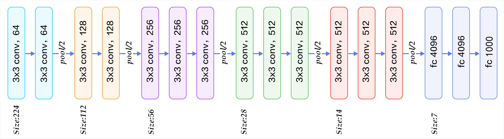
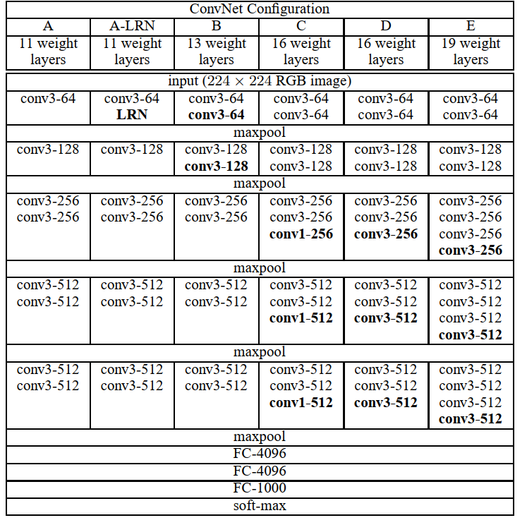
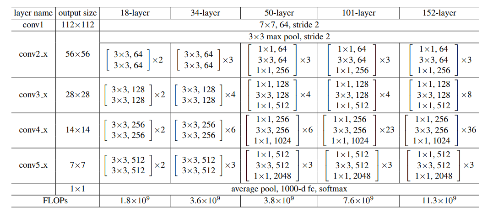

# 深度卷积神经网络

神经网络可以直接基于图像的原始像素进行分类。这种称为端到端（end-to-end）的方法节省了很多中间步骤。这类图像分类研究的主要流程是：

1. 获取图像数据集；
2. 使用已有的特征提取函数生成图像的特征；
3. 使用机器学习模型对图像的特征分类。

## 学习特征表示

在深度学习网络中，特征是由学习得来。==为了表征足够复杂的输入，特征本身应该分级表示==。持这一想法的研究者们相信，多层神经网络可能可以学得的数据的多级表征，并逐级表示越来越抽象的概念或模式。以图像分类为例，在多层神经网络中，图像的第一级的表示可以是在特定的位置和角度是否出现边缘。而第二级的表示说不定能够将这些边缘组合出有趣的模式，例如花纹。这样逐级表示下去，最终，模型能够较容易根据最后一级的表示完成分类任务。需要强调的是，输入的逐级表示由多层模型中的参数决定，而这些参数都是学出来的。

然而，另一些研究者则持异议。他们认为特征本身也应该由学习得来。他们还相信，为了表征足够复杂的输入，特征本身应该分级表示。持这一想法的研究者们相信，多层神经网络可能可以学得的数据的多级表征，并逐级表示越来越抽象的概念或模式。以图像分类为例，并回忆[“二维卷积层”](conv-layer.md)一节中物体边缘检测的例子。在多层神经网络中，图像的第一级的表示可以是在特定的位置和⻆度是否出现边缘。而第二级的表示说不定能够将这些边缘组合出有趣的模式，例如花纹。在第三级的表示中，也许上一级的花纹能进一步汇合成对应物体特定部位的模式。这样逐级表示下去，最终，模型能够较容易根据最后一级的表示完成分类任务。需要强调的是，输入的逐级表示由多层模型中的参数决定，而这些参数都是学出来的。

### 缺失要素一：数据

包含许多特征的深度模型需要大量的有标签的数据才能表现得比其他经典方法更好。ImageNet数据集同时推动计算机视觉和机器学习研究进入新的阶段，使得此前的传统方法不再有优势。

### 缺失要素二：硬件

深度学习对计算资源要求很高。

## AlexNet

第一，AlexNet包含8层变换，其中有五层卷积和两层全连接隐含层，以及一个全连接输出层。

第二，AlextNet将sigmoid激活函数改成了更加简单的ReLU激活函数。一方面，ReLU激活函数的计算更简单。另一方面，ReLU激活函数在不同的参数初始化方法下使模型更容易训练。这是由于sigmoid激活函数输出极接近0或1时，区域的梯度几乎为0，从而造成反向传播无法更新部分模型参数；而ReLU激活函数在正区间的梯度恒为1。

第三，AlextNet通过Dropout来控制全连接层的模型复杂度。

第四，AlextNet引入了大量的图像增广，例如翻转、裁剪和颜色变化，从而进一步扩大数据集来缓解过拟合。

## 使用重复元素的网络（VGG）

AlexNet在LeNet的基础上增加了三个卷积层。但AlexNet作者对它们的卷积窗口、输出通道数和构造顺序均做了大量的调整。虽然AlexNet指明了深度卷积神经网络可以取得出色的结果，但并没有提供简单的规则以指导后来的研究者如何设计新的网络。

## 网络中的网络（NiN）

网络中的网络（NiN）提出了另外一个思路，串联多个由卷积层和“全连接”层构成的小网络来构建一个深层网络。

### NiN块

我们知道，卷积层的输入和输出通常是四维数组（样本，通道，高，宽），而全连接层的输入和输出则通常是二维数组（样本，特征）。如果想在全连接层后再接上卷积层，则需要将全连接层的输出变换为四维。它可以看成全连接层：其中空间维度（高和宽）上的每个元素相当于样本，通道相当于特征。因此，NiN使用$1\times 1$卷积层来替代全连接层，从而使空间信息能够自然传递到后面的层中去。

NiN块是NiN中的基础块。它由一个卷积层加两个充当全连接层的$1\times 1​$卷积层串联而成。其中第一个卷积层的超参数可以自行设置，而第二和第三个卷积层的超参数一般是固定的。

### NiN模型

NiN使用卷积窗口形状分别为$11\times 11$、$5\times 5$和$3\times 3$的卷积层，相应的输出通道数也与AlexNet中的一致。每个NiN块后接一个步幅为2、窗口形状为$3\times 3$的最大池化层。

除了使用NiN块以外，NiN还有一个设计与AlexNet有显著不同：NiN去掉了AlexNet最后的三个全连接层。取而代之的，NiN使用了输出通道数等于标签类别数的NiN块，然后使用全局平均池化层对每个通道中所有元素求平均并直接用于分类。这里的全局平均池化层即窗口形状等于输入空间维形状的平均池化层。NiN的这个设计的好处是可以显著减小模型参数尺寸，从而很好地缓解过拟合。然而，该设计有时会造成模型训练时间的增加。

NiN的训练与AlexNet和VGG的类似，但一般使用更大的学习率。

## 含并行连结的网络（GoogLeNet）

### Inception 块

GoogLeNet中的基础卷积块叫做Inception块。

由图可以看出，Inception块里有四条并行的线路。前三条线路使用窗口大小分别是$1\times 1$、$3\times 3$和$5\times 5$的卷积层来抽取不同空间尺寸下的信息。其中中间两个线路会对输入先做$1\times 1$卷积来减少输入通道数，以降低模型复杂度。第四条线路则使用$3\times 3$最大池化层，后接$1\times 1​$卷积层来改变通道数。四条线路都使用了合适的填充来使得输入输出高和宽一致。最后我们将每条线路的输出在通道维上连结，并输入到接下来的层中去。

Inception块中可以自定义的超参数是每个层的输出通道数，我们以此来控制模型复杂度。

## GoogLeNet模型

GoogLeNet跟VGG一样，在主体卷积部分中使用五个模块（block），每个模块之间使用步幅为2的$3\times 3$最大池化层来减小输出高宽。第一模块使用一个64通道的$7\times 7$卷积层。

第二模块使用两个卷积层：首先是64通道的$1\times 1$卷积层，然后是将通道增大3倍的$3\times 3$卷积层。它对应Inception块中的第二条线路。

第三模块串联两个完整的Inception块。第一个Inception块的输出通道数为$64+128+32+32=256$，其中四条线路的输出通道数比例为$64:128:32:32=2:4:1:1$。其中第二、第三条线路先分别将输入通道数减小至$96/192=1/2$和$16/192=1/12$后，再接上第二层卷积层。第二个Inception块输出通道数增至$128+192+96+64=480$，每条线路的输出通道数之比为$128:192:96:64 = 4:6:3:2$。其中第二、第三条线路先分别将输入通道数减小至$128/256=1/2$和$32/256=1/8$。

第四模块更加复杂。它串联了五个Inception块，其输出通道数分别是$192+208+48+64=512$、$160+224+64+64=512$、$128+256+64+64=512$、$112+288+64+64=528$和$256+320+128+128=832$。这些线路的通道数分配和第三模块中的类似：含$3\times 3$卷积层的第二条线路输出最多通道，其次是仅含$1\times 1$卷积层的第一条线路，之后是含$5\times 5$卷积层的第三条线路和含$3\times 3$最大池化层的第四条线路。其中第二、第三条线路都会先按比例减小通道数。这些比例在各个Inception块中都略有不同。

第五模块有输出通道数为$256+320+128+128=832$和$384+384+128+128=1024$的两个Inception块。其中每条线路的通道数分配思路和第三、第四模块中的一致，只是在具体数值上有所不同。需要注意的是，第五模块的后面紧跟输出层，该模块同NiN一样使用全局平均池化层来将每个通道的高和宽变成1。最后我们将输出变成二维数组后接上一个输出个数为标签类数的全连接层。

GoogLeNet模型的计算复杂，而且不如VGG那样便于修改通道数。

# 残差网络（ResNet）

==问题：==对神经网络模型添加新的层，充分训练后的模型是否只可能更有效地降低训练误差？

理论上，原模型解的空间只是新模型解的空间的子空间。也就是说，如果我们能将新添加的层训练成恒等映射$f(x) = x$，新模型和原模型将同样有效。由于新模型可能得出更优的解来拟合训练数据集，添加层似乎更容易降低训练误差。然而在实践中，添加过多的层后训练误差往往不降反升。

## 残差块

让我们聚焦于神经网络局部。如图5.9所示，设输入为$\boldsymbol{x}$。假设我们希望学出的理想映射为$f(\boldsymbol{x})$，以作为上方激活函数的输入。左图虚线框中部分需要直接拟合出该映射$f(\boldsymbol{x})$。而右图虚线框中部分则需要拟合出残差（residual）映射$f(\boldsymbol{x})-\boldsymbol{x}$。==残差映射在实际中往往更容易优化。【$f(\boldsymbol{x})$就可以认为是备求函数，$f(\boldsymbol{x})-\boldsymbol{x}$是其导数，在求解函数中，可以认为函数的导数比函数更容易求得。】==

以本节开头提到的恒等映射作为我们希望学出的理想映射$f(\boldsymbol{x})$，并以ReLU作为激活函数。我们只需将图中右图上方加权运算（例如仿射）的权重和偏差参数学成零，那么上方ReLU的输出就会与输入$\boldsymbol{x}$恒等。图右图也是ResNet的基础块，即残差块（residual block）。在残差块中，输入可通过跨层的数据线路更快地向前传播。

### ResNet模型

ResNet的前两层跟之前介绍的GoogLeNet一样：在输出通道数为64、步幅为2的$7\times 7​$卷积层后接步幅为2的$3\times 3​$的最大池化层。不同之处在于ResNet每个卷积层后增加的批量归一化层。

GoogLeNet在后面接了四个由Inception块组成的模块。ResNet则使用四个由残差块组成的模块，每个模块使用若干个同样输出通道数的残差块。第一个模块的通道数同输入通道数一致。由于之前已经使用了步幅为2的最大池化层，所以无需减小高和宽。之后的每个模块在第一个残差块里将上一个模块的通道数翻倍，并减半高和宽。

下面我们实现这个模块。注意，我们对第一个模块做了特别处理。

接着我们为ResNet加入所有残差块。这里每个模块使用两个残差块。

最后，与GoogLeNet一样，加入全局平均池化层后接上全连接层输出。

这里每个模块里有4个卷积层（不计算$1\times 1$卷积层），加上最开始的卷积层和最后的全连接层，共计18层。这个模型也通常被称为ResNet-18。通过配置不同的通道数和模块里的残差块数我们可以得到不同的ResNet模型，例如更深的含152层的ResNet-152。虽然ResNet的主体架构跟GoogLeNet的类似，但ResNet结构更加简单，修改也更加方便。这些因素都导致了ResNet迅速被广泛使用。

# 稠密连接网络（DenseNet）

ResNet中的跨层连接设计引申出了数个后续工作。这一节我们介绍其中的一个：稠密连接网络（DenseNet） [1]。 它与ResNet的主要区别如图5.10所示。

图5.10中将部分前后相邻的运算抽象为模块$A$和模块$B$。与ResNet的主要区别在于，DenseNet里模块$B$的输出不是像ResNet那样和模块$A$的输出相加，而是在通道维上连结。这样模块$A$的输出可以直接传入模块$B$后面的层。在这个设计里，模块$A$直接跟模块$B$后面的所有层连接在了一起。这也是它被称为“稠密连接”的原因。

DenseNet的主要构建模块是稠密块（dense block）和过渡层（transition layer）。前者定义了输入和输出是如何连结的，后者则用来控制通道数，使之不过大。

## 稠密块

DenseNet使用了ResNet改良版的“批量归一化、激活和卷积”结构（参见上一节练习），我们首先在`conv_block`函数里实现这个结构。

稠密块由多个`conv_block`组成，每块使用相同的输出通道数。但在前向计算时，我们将每块的输入和输出在通道维上连结。

在下面的例子中，我们定义一个有两个输出通道数为10的卷积块。使用通道数为3的输入时，我们会得到通道数为$3+2\times 10=23$的输出。卷积块的通道数控制了输出通道数相对于输入通道数的增长，因此也被称为增长率（growth rate）。

## 过渡层

由于每个稠密块都会带来通道数的增加，使用过多则会带来过于复杂的模型。过渡层则用来控制模型复杂度。它通过$1\times1$卷积层来减小通道数，并使用步幅为2的平均池化层减半高和宽，从而进一步降低模型复杂度。

对上一个例子中稠密块的输出应用通道数为10的过渡层。此时输出的通道数减为10，高和宽减半。

## DenseNet模型

我们来构造DenseNet模型。DenseNet首先使用跟ResNet一样的单卷积层和最大池化层。

类似于ResNet接下来使用的四个残差块，DenseNet使用的是四个稠密块。同ResNet一样，我们可以设置每个稠密块使用多少个卷积层。这里我们设成4，跟上一节的ResNet-18保持一致。稠密块里的卷积层通道数（即增长率）设为32，所以每个稠密块将增加128个通道。

ResNet里通过步幅为2的残差块在每个模块之间减小高和宽。这里我们则使用过渡层来减半高和宽，并减半通道数。

## 小结

#### AlexNet

* AlexNet跟LeNet结构类似，但使用了更多的卷积层和更大的参数空间来拟合大规模数据集ImageNet。它是浅层神经网络和深度神经网络的分界线。
* 虽然看上去AlexNet的实现比LeNet也就多了几行而已，但这个观念上的转变和真正优秀实验结果的产生，学术界为之花了很多年。

#### VGG

* VGG-11通过5个可以重复使用的卷积块来构造网络。根据每块里卷积层个数和输出通道数的不同可以定义出不同的VGG模型。

#### Nin

* NiN重复使用由卷积层和代替全连接层的$1\times 1$卷积层构成的NiN块来构建深层网络。
* NiN去除了容易造成过拟合的全连接输出层，而是将其替换成输出通道数等于标签类别数的NiN块和全局平均池化层。
* NiN以上的设计思想影响了后面一系列卷积神经网络的设计。

#### GoogleNet

- Inception块相当于一个有四条线路的子网络。它通过不同窗口形状的卷积层和最大池化层来并行抽取信息，并使用$1\times 1$卷积层减少通道数从而减小模型复杂度。
- GoogLeNet将多个设计精细的Inception块和其他层串联起来。其中Inception块的通道数分配之比是在ImageNet数据集上通过大量的实验得来的。
- GoogLeNet和它的后继者们一度是ImageNet上最高效的模型之一：在类似的测试精度下，它们的计算复杂度往往更低。

#### ResNet

- 残差块通过跨层的数据通道从而能够训练出有效的深度神经网络。
- ResNet深刻影响了后来的深度神经网络的设计。

#### DenseNet

- 在跨层连接上，不同于ResNet中将输入与输出相加，DenseNet在通道维上连结输入与输出。
- DenseNet的主要构建模块是稠密块和过渡层。

## 练习

- 调节超参数，提高分类准确率。

- 为什么NiN块里要有两个$1\times 1$卷积层？去除其中的一个，观察并分析实验现象。

- GoogLeNet有数个后续版本。尝试实现并运行它们，观察实验结果。这些后续版本包括加入批量归一化层（后面章节将介绍）[2]、对Inception块做调整 [3] 和加入残差连接（后面章节将介绍）[4]。

- 对比AlexNet、VGG和NiN、GoogLeNet的模型参数尺寸。为什么后两个网络可以显著减小模型参数尺寸？

- DenseNet论文中提到的一个优点是模型参数比ResNet的更小，这是为什么？

- DenseNet被人诟病的一个问题是内存消耗过多。真的会这样吗？可以把输入形状换成$224\times 224$，来看看实际（GPU）内存消耗。

- 实现DenseNet论文中的表1提出的各个DenseNet版本 [1]。

  

## 参考文献

[1] Simonyan, K., & Zisserman, A. (2014). Very deep convolutional networks for large-scale image recognition. arXiv preprint arXiv:1409.1556.

[2] Lin, M., Chen, Q., & Yan, S. (2013). Network in network. arXiv preprint arXiv:1312.4400.

[3] He, K., Zhang, X., Ren, S., & Sun, J. (2016). Deep residual learning for image recognition. In Proceedings of the IEEE conference on computer vision and pattern recognition (pp. 770-778).

[4] He, K., Zhang, X., Ren, S., & Sun, J. (2016, October). Identity mappings in deep residual networks. In European Conference on Computer Vision (pp. 630-645). Springer, Cham.(Resnet 改进)

[5] Huang, G., Liu, Z., Weinberger, K. Q., & van der Maaten, L. (2017). Densely connected convolutional networks. In Proceedings of the IEEE conference on computer vision and pattern recognition (Vol. 1, No. 2).