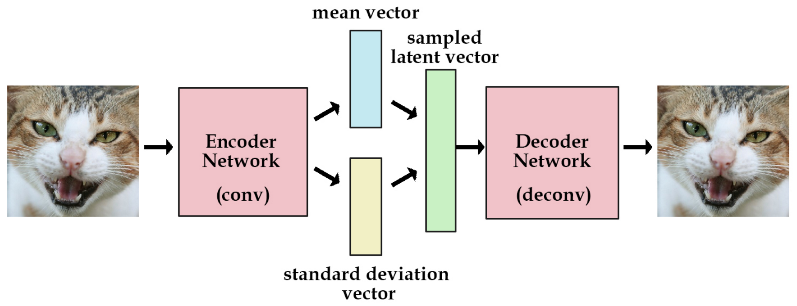

# Auto-Encoder

## BASIS

原始的 AutoEncoder 结构很简单：Input Layer、Hidden Layer、Output Layer。此网络的约束有：

1. Hidden Layer 的维度要远小于 Input Layer
2. Output 用于重构 Input，也即让误差$L(Input, \ Output)$ 最小

因此，可以用 Hidden Layer 中神经元组成的向量（ Code）来表示 Input，就达到了对 Input **压缩**的效果。AutoEncoder 的训练方式就是普通的 BP。其中，将 Input 压缩为 Code 的部分称为 encoder，将 Code 还原为 Input 的部分称为 decoder。事实上，AutoEncoder 其实是**增强的 PCA**：AutoEncoder 具有非线性变换单元，因此学出来的 Code 可能更精炼，对 Input 的表达能力更强。AutoEncoder 是多层神经网络，其中输入层和输出层表示相同的含义，具有相同的节点数。AutoEncode学习的是一个**输入输出相同的“恒等函数”**。AutoEncoder的意义在于学习的（通常是节点数更少的）中间coder层（最中间的那一层），这一层是输入向量的良好表示。

虽然用 AutoEncoder 来压缩理论上看起来很智能，但是实际上并不太好用：

1. 由于 AutoEncoder 是训练出来的，故它的压缩能力仅适用于与训练样本相似的样本
2. AutoEncoder 还要求 encoder 和 decoder 的能力不能太强。极端情况下，它们有能力完全记忆住训练样本，由此失去本来的压缩功能。

Autoencoder 期望利用样本自适应学习出稳健、表达能力强、扩展能力强的 Code 的设想很好，但是实际中应用场景却很有限。一般可以用于数据的降维、或者辅助进行数据的可视化分析。

## EXPAND

### **Sparse AutoEncoder**

 **Sparse Representation** —— Sparse AutoEncoder（SAE）是对 AutoEncoder 的 Code 增加了稀疏的约束。稀疏具有很多良好的性质，如：

- 有**降维**的效果，可以用于提取主要特征
- 由于可以抓住主要特征，故具有一定**抗噪**能力
- 稀疏的**可解释性好**，现实场景大多满足这种约束（如“奥卡姆剃刀定律”）

增加了稀疏约束后的 AutoEncoder 的损失函数定义如下：
$$
L_{sparse}=L+ \beta \sum_{j}KL(\rho||\widehat\rho_j)​
$$
其中，$KL$表示 KL散度，$\rho$表示网络中神经元的期望激活程度（若 Activation 为 Sigmoid 函数，此值可设为 0.05，表示大部分神经元未激活），$\rho_j$表示第$j$个神经元的平均激活程度。在此处，KL散度 定义如下:
$$
KL(\rho||\widehat\rho_j)=\rho log\frac{\rho}{\widehat\rho_j}+(1-\rho) log\frac{1-\rho}{1-\widehat\rho_j}
$$
其中，$\widehat\rho_j$定义为训练样本集上的平均激活程度，公式如下。其中$x^{(i)}$表示第$i$个训练样本
$$
\widehat\rho_j=\frac{1}{m}\sum_i[a_j(x^{(i)})]
$$

### **Denoising AutoEncoder**

Denoising AutoEncoder（DAE）是在“Vincent Extracting and composing robust features with denoising autoencoders”中提出的，本质就是在原样本中增加噪声，并期望利用 DAE 将加噪样本来还原成纯净样本。以图像为例，对图像中的像素以一定概率遮挡，作为输入。随后利用 DAE 进行恢复。由于增加了噪声，因此学习出来的 Code 会更加稳健。目前应用不多。

### **Variational AutoEncoder**

由于抽象特征z是从正态分布采样生成而来，因此VAE的encoder部分是一个生成模型，然后再结合decoder来实现重构保证信息没有丢失。VAE是一个里程碑式的研究成果，倒不是因为他是一个效果多么好的生成模型，主要是提供了一个结合概率图的思路来增强模型的鲁棒性。

VAE的主要结构和AE的区别在于添加了mean vector和standard deviation vector的生成模块，两个模块可以是Encoder输出的向量接两个全连接层，通过学习得到Code的均值和方差，通过$KL-divergence$来衡量和约束学习到的mead和stddev。而后从生成的分布里面加入随机噪声送入Decoder内生成图片。此处的$KL-divergence$应当是正值，其值为0表示两个分布相同，越大表示分布越不相同。
$$
KL(N(\mu,\sigma^2)||N(0,1))=\frac{1}{2}(-log\sigma^2+\mu^2+\sigma^2-1)
$$

$$
L_{total} = L_{rec}+L_{KL}
$$

VAE除了能让我们能够自己产生随机的潜在变量，这种约束也能提高网络的产生图片的能力，可以认为潜在变量是一种数据的转换。

我们假设我们有一堆实数在区间[0, 10]上，每个实数对应一个物体名字。比如，5.43对应着苹果，5.44对应着香蕉。当有个人给你个5.43，你就知道这是代表着苹果。我们能用这种方法够编码无穷多的物体，因为[0, 10]之间的实数有无穷多个。但是，如果某人给你一个实数的时候其实是加了高斯噪声的呢？比如你接受到了5.43，原始的数值可能是 [4.4 ~ 6.4]之间的任意一个数，真实值可能是5.44(香蕉)。

如果给的方差越大，那么这个平均值向量所携带的可用信息就越少。现在，我们可以把这种逻辑用在编码器和解码器上。编码越有效，那么标准差向量就越能趋近于标准高斯分布的单位标准差。这种约束迫使编码器更加高效，并能够产生信息丰富的潜在变量。这也提高了产生图片的性能。而且我们的潜变量不仅可以随机产生，也能从未经过训练的图片输入编码器后产生。

### Adversarial AutoEncoder

对抗自编码器的网络结构主要分成两大部分：自编码部分（上半部分）、GAN判别网络（下半部分）。整个框架也就是GAN和AutoEncoder框架二者的结合。训练过程分成两个阶段：首先是样本重构阶段，通过梯度下降更新自编码器encoder部分、以及decoder的参数、使得重构损失函数最小化；然后是正则化约束阶段，交替更新判别网络参数和生成网络（encoder部分）参数以此提高encoder部分混淆判别网络的能力。

一旦训练完毕，自编码器的encoder部分便学习到了从样本数据x到抽象特征z的映射关系。

效果可见：[对抗自编码器：Adversarial Autoencoders](https://closure11.com/对抗自编码器：adversarial-autoencoders/)

