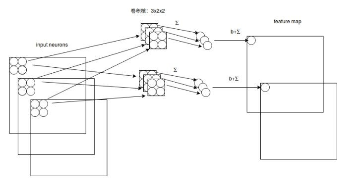
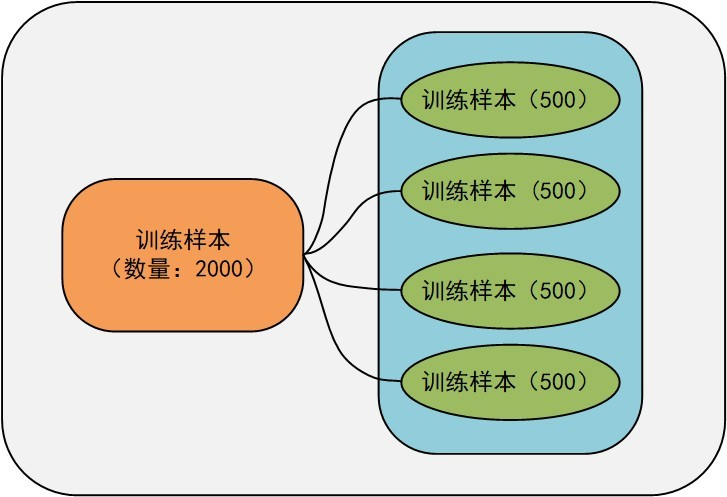
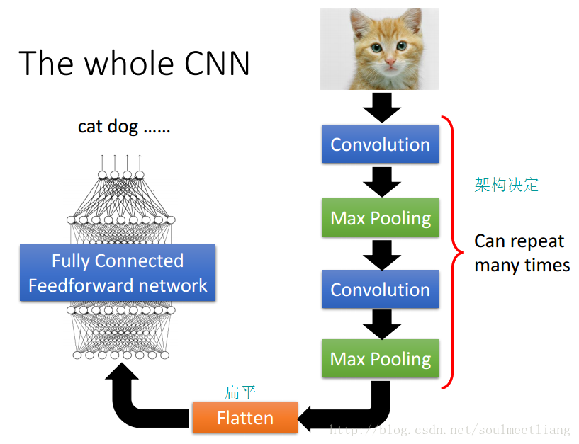
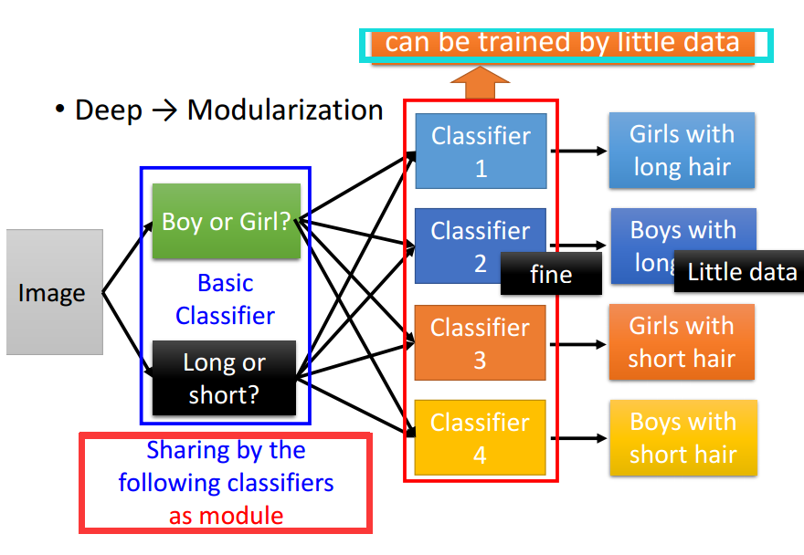

# 问题 & 解决

- #### $L_1-Regularization$ 和$L_2-Regularization$的区别

  ##### Regularization

  $$
  L(\bold W)=MSE_{train}+\lambda {\bold W^T} {\bold W}
  $$

   $L_2-Regularization$对参数惩罚比较大。

  对于同样能够满足训练数据的函数，我们更加倾向平方$L_2$范数更小的那一组权值。其中，$\lambda$表示我们倾向于更小权重值的意愿有多强烈。为什么选择平方$L_2$范数更小的权值呢？因为平方$L_2$范数更小，表明$W$中的每一个元素都比较小，甚至接近于0。这意味着得到的函数曲线更加平滑，起伏更小。而平滑的曲线正好是我们在遇到曲线过拟合时希望得到的结果。这种给损失函数增加一个表示倾向性的部分的做法，叫做正规化（Regularization），是解决过拟合问题的重要工具。

  

- ####  深度学习中的容量(capacity) 

  在设计神经网络时，当训练出的模型表现出欠拟合时，我们通常会尝试增加神经网络的层数或者某些层的神经元数目。这也被成为增加神经网络的容量(Capacity)。容量其实是指一个神经网络的假设空间（hypothesis space） 是指一个机器学习算法可以生成的所有函数的集合。一个算法的假设空间，决定了算法的能力边界。 

  

- #### 多通道卷积方式

- #### “参数”和“超参数”

  “参数”既是我们的模型需要学习的内容，它是模型“内部”的变量，比如模型的权重矩阵和偏置。而超参数是指在一个模型中，我们可以人为设定和修改的参数，例如神经网络的层数、学习率以及隐藏层神经元的个数等。

  

- #### Batch ，epoch 和 iteration的区别

  **Epoch** 

  当我们使用一个完成的数据集通过了神经网络并且返回了一次，这个过程称为一次epoch，通俗的说就是所有的训练样本完成一次forward和backward propagation。可能我们的数据很大，由于硬件水平的限制（内存等），我们不得不将数据分成多块，分批次进行训练。这时候每个批次的数据集称为Batch 。

  **Batch size** 

  指的是每个batch中数据的个数。或者说一次forward和backward propagation运算中需要的样本个数。这么来理解，深度学习的参数的损失函数的更新不是一个由数据获得的。而是由一组（一批次）数据加权得到的，这组数据就是Batch,而它的数量我们称为Batch Size. 

  **Iterations** 

  每一次迭代我们网络中参数（权重）会进行一次更新，每次更新需要每个Batch 中的batch size 个数据进行运算得到损失函数，在进行反向传播更新参数（权重）

   

  样本数量2000，batch = 4 , batch size = 500, iterations = 4 

  

- #### 分割的区分

  ##### superpixels（超像素） 

  超像素是一系列像素的集合，这些像素具有类似的颜色、纹理等特征，距离也比较近。 

  ##### Semantic Segmentation（语义分割） 

  把图像中每个像素赋予一个类别标签（比如汽车、建筑、地面、天空等），用不同的颜色来表示。 但是语义分割只能判断类别，无法区分个体。 

  ##### Instance Segmentation（实例分割） 

  实例分割方式有点类似于物体检测，不过物体检测一般输出的是 bounding box，实例分割输出的是一个mask。 它只需要找到感兴趣物体的边缘轮廓就行，我们可以看到每个人都是不同的颜色的轮廓，因此我们可以区分出单个个体。 

  ##### Panoptic Segmentation（全景分割） 

  全景分割，是语义分割和实例分割的结合。 

- #### **$sigmoid$函数和$ReLU$函数**

  ​    $sigmoid​$激活函数，它的缺点之一是容易饱和，$Logistic​$函数只在坐标原点附近有很明显的梯度变化，其两端的函数变化非常平缓，这会导致我们在使用反向传播算法更新参数的时候出现梯度消失的问题，并且随着网络层数的增加问题会越严重。 

  ​    $ReLU$激活函数的收敛速度相较于$Logistic$函数和$Tanh$函数要快很多，$ReLU$函数在轴左侧的值恒为零，这使得网络具有一定的稀疏性，从而减小参数之间的依存关系，缓解过拟合的问题，并且$ReLU$函数不存在梯度消失的问题。但是$ReLU$的强制稀疏处理虽然可以缓解过拟合问题，但是也可能产生特征屏蔽过多，导致模型无法学习到有效特征的问题。 

  

  

  用 ==Maxout==来根据training data自动生成activation function，也就是learnable activation function。 

  ReLU is a special cases of Maxout！！ 

  

  

- #### 感受野

  $5×5$感受野比$3×3$要好，但是参数多，如果缩小卷积核该为两个$3×3$的叠加，相当于感受野保持不变。

  感受野（receptive field）

- #### CNN网络

  其中的**Convolution**就好比是一个特征提取块，能凸显出需要注意到的特征。**Max-Pooling**相当于，同时可以确定特征的位置。 **flatten**实际上是在展宽特征，最终得到结果。 

  CNN往往会把特征更加凸显出来。将大的值变得更大，小的降低。 

  CNN本质上是一个函数，各层可以理解为将一些特征模块化。

  

  

- 

- 

- 

- 