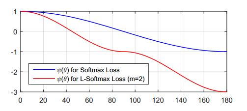
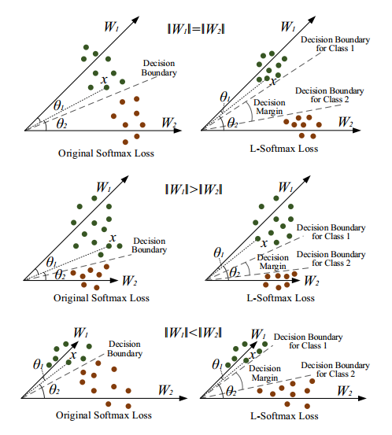
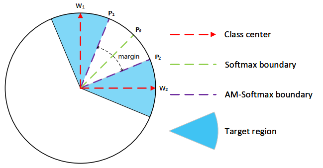
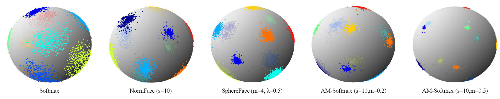

# AM-softmax

## softmax loss 

定义网络中第$i$个输入特征$X_i$以及它的标签$y_i$时，softmax loss表示为：

$f(z_k)=e^{z_k}/(\sum_je^{z_j}) \ \rightarrow \ l(y,z)=-\sum^C_{k=0}y_Clog(f(z_C))=log\sum_je^{z_j}-loge^{z_y}​$

$L=\frac{1}{N}\sum_iL_i=\frac{1}{N}\sum_i-log(\frac{e^{f_{y_i}}}{\sum_j e^{f_j}})​$

其中$f_j​$表示最终的全连接的类别输出向量 $f​$ 的第 $j​$ 个元素, $N​$ 为训练样本的个数。由于 ff 是全连接层的激活函数 $W​$ 的输出，所以 $f_{y_i}​$ 可以表示为 $f_{y_i}=W^T_{y_i}x_i​$, 最终的损失函数又可以写为：

$L_i=-log(\frac{e^{||W_{y_i}||||x_i||cos(\theta_{y_i})}}{\sum_je^{||W_{j}||||x_i||cos(\theta_{j})}})​$

虽然softmax在深度卷积神经网络中有着广泛的应用，但是这种形式并不能够有效地学习得到使得类内较为紧凑、类间较离散的特征。

## 动机

初始的$softmax​$的目的是使得$W^T_1x>W^T_2x​$，即 $∥W1∥∥x∥cos(θ1)>∥W2∥∥x∥cos(θ2)​$而得到 $x​$ （来自类别1）正确的分类结果。作者提出large-magrin softmax loss的动机是希望通过增加一个正整数变量 $m​$，从而产生一个决策余量，能够更加严格地约束上述不等式，即：$∥W1∥∥x∥cos(θ1)≥∥W1∥∥x∥cos(mθ1)>∥W2∥x∥cos(θ2)​$

其中$0≤θ1<πm​$。如果 $W_1​$和 $W_2​$ 能够满足$‖W_1‖‖x‖cos(mθ_1)>‖W_2‖‖x‖cos(θ_2)​$，那么就必然满足$∥W_1∥∥x∥cos(θ_1)>∥W_2∥∥x∥cos(θ_2)​$。这样的约束对学习$W_1​$ 和 $W_2​$ 的过程提出了更高的要求，从而使得1类和2类有了更宽的分类决策边界。

ps：基于softmax loss学习同类和不同类样本时，都用的是同一种格式，因此学习到的特征的类内和类间的可区分性不强。而这篇论文是在学习同类样本时，特意增强了同类学习的难度，这个难度要比不同类的难度要大些。这样的区别对待使得特征的可区分性增强

## Large-Margin Softmax Loss

因此L-softmax可以表示为：

$L_i=-log(\frac{e^{||W_{y_i}||||x_i||\psi(\theta_{y_i}))}}{e^{||W_{y_i}||||x_i||\psi(\theta_{y_i}))} +\sum_{j\neq y_i }e^{||W_{j}||||x_i||cos(\theta_{j})}})​$

其中$\psi(\theta)$可以表示为：
$$
\psi(\theta)=\begin{cases}
cos(m\theta), & 0 \leq\theta \leq \frac{\pi}{m}\\
D(\theta),& \frac{\pi}{m}\leq\theta \leq \pi
\end{cases}
$$
当 $m$ 越大时，分类的边界越大，学习难度当然就越高。同时，公式中的 $D(θ)$ 必须是一个单调减函数且$ D(π/m)=cos(π/m)$， 以保证 $ψ(θ)$ 是一个连续函数。

为了简化前项和后向传播，构建了新的函数$\psi(\theta)$:
$$
\psi(\theta)=(-1)^kcos(m\theta)-2k, \quad \theta \in [\frac{k\pi}{m},\frac{(k+1)\pi}{m}]
$$
其中$k$是一个整数在$[0,m-1]$区间。可以看到两种方法的比较：

[论文](http://proceedings.mlr.press/v48/liud16.pdf)也提到了里面的如何将$cos(mθ_{y_i})$替换为 $cos(θ_{y_i})$ 和 $m$ 的函数，最终的L-Softmax loss 函数就可以分别对 $\bold x$ 和 $\bold W​$ 进行求导。

最终的L-Softmax loss 函数就可以分别对 $\bold x$ 和$ \bold W$ 进行求导。

在训练过程中，当 $W_1=W_2$ 时，softmax loss 要求 $θ_1<θ_2$, 而 L-Softmax则要求$mθ_1<θ_2$,我们从图中可以看到L-Softmax得到了一个更严格的分类标准。当$W_1>W_2$ 和 $W_1<W_2$时，虽然情况会复杂些，但是同样可以看到L-Softmax会产生一个较大的决策余量。

==增加了类间特征差异，减少了类内特征差异，使得分类更准确==

## AM-softmax

AM-softmax融合了两种softmax loss的特点，修改了$cos(m\theta)$为一个新函数：

$\psi(\theta)=cos\theta-m​$

比起L-softmax来说计算简单，可以达到减小对应标签项的概率，增大损失的效果，因此对同一类的聚合更有帮助。

除了将$b=0$, $||W||=1$，作者进一步将$||x||=1$，最终的AM-Softmax写为：
$$
L_{AMS}=-\frac{1}{N}\sum^{N}_{i=1}log\frac{e^{s(cos\theta_{y_i}-m)}}{e^{s(cos\theta_{y_i}-m)}+\sum^{C}_{j=1,j\neq y_i}e^{scos(\theta_j)}}
$$
其中$s$是个缩放因子，文章中固定为30。

### 几何讨论

$m$的取值大小也在控制着了分类边界的大小。两类分类吕，对于1类的分类边界从$W^T_1P_0=W^T_2P_0$变为了$W^T_1P_0−m=W^T_2P_0$。

### 角度距离与余弦距离

作者认为，Asoftmax是用$m​$乘以$θ​$，而AMSoftmax是用$cosθ​$减去$m​$，这是两者的最大不同之处：一个是**角度距离**，一个是**余弦距离**。

使用传统的Softmax的时候，角度距离和余弦距离是等价的，即$cos\theta_1=cos\theta_2\quad \rightarrow \quad \theta_1=\theta_2$

但是当我们试图要推动决策边界的时候，角度距离和余弦距离就有所不同了。

最终的决策边界是和余弦相关的，根据cos的性质，优化角度距离比优化余弦距离更有效果，因为余弦距离相对更密集

之所以选择$cosθ-m​$而不是$cos（θ-m）​$，这是因为我们从网络中得到的是$W​$和$f​$的内积，如果要优化$cos（θ-m）​$那么会涉及到$arccos​$操作，计算量过大。

## 另外

在论文【1】中提到，质量较差的人脸图片的feature norm越小。在进行了feature normalizaiton后，这些质量较差的图片特征会产生更大的梯度，导致网络在训练过程中将更多的注意力集中在这些样本上。因此，对于数据集图片质量较差时，更适合采用feature normalization。

