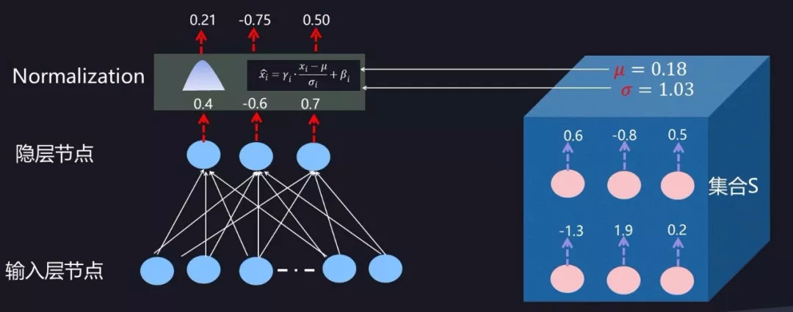
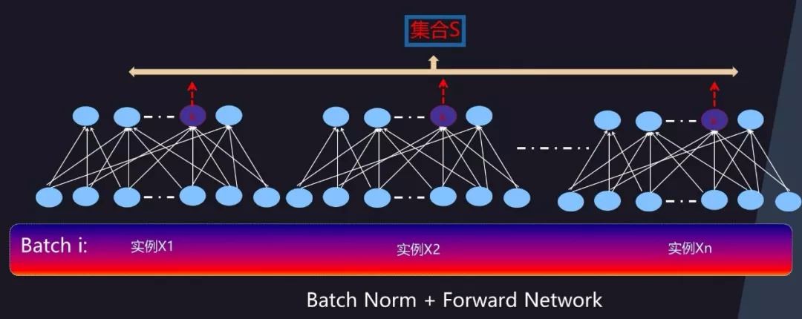
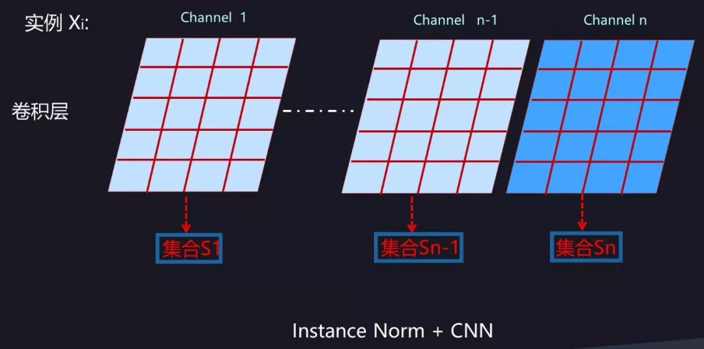
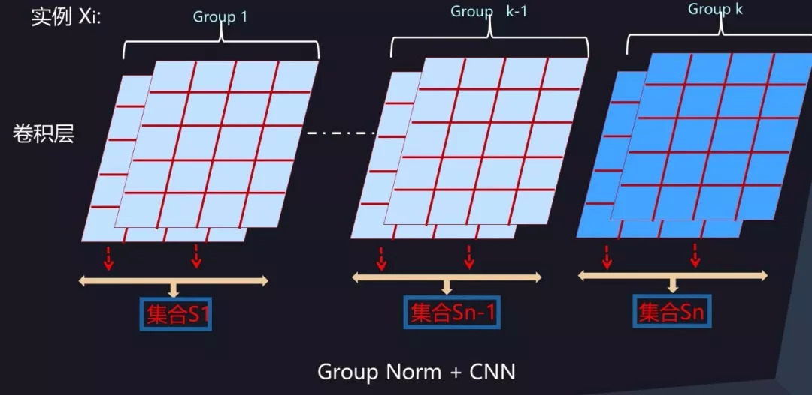
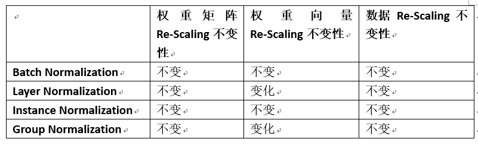

# Normalization

Normalization按照涉及对象的不同可以分为

- 对第$ L $层每个神经元的激活值或者说对于第 $L+1 $层网络神经元的输入值进行 Normalization 操作，比如 Batch Norm/Layer Norm/Instance Norm/Group Norm 等方法都属于这一类；
- 对权重进行规范化操作，比如 Weight Norm。 在损失函数中的 $L1/L2$ 等正则项，本质上也属于这第二类规范化操作。（$L1$ 正则的规范化目标是造成**参数的稀疏化**，争取达到让大量参数值取得 0 值的效果，而 $L2$ 正则的规范化目标是有效减小原始参数值的大小。由此来避免模型过拟合）

## 针对值的Norm

- 公式

$$
a_i^{norm}=\gamma_i \frac{a_i-\mu}{\sigma_i}+\beta_i \
\\mu=\frac{1}{m}\sum^m_{k=1}a_k \quad k \in S\  and\  ||S||=m \
\ \sigma_i=\sqrt{\frac{1}{m}\sum_{k=1}^m(a_k-\mu)^2+\varepsilon}
$$

​       $a_i$ 为某个神经元原始激活值，$a_i^{norm}$为经过规范化操作后的规范后值。 $μ $是通过神经元集合 $S$中包含的 $m$ 个神经元各自的激活值求出的均值 $σ_i $为根据均值和集合$ S$ 中神经元各自激活值求出的激活值标准差

- 主要目标是让每个神经元在训练过程中学习到对应的两个调节因子$\gamma_i$和$\beta_i$，对规范到 0 均值，1 方差的值进行微调。因为经过第一步操作后，Normalization 有可能降低神经网络的非线性表达能力，所以会以此方式来补偿 Normalization 操作后神经网络的表达能力。  

> 最早Batch Normalization后，Layer Normalization/Instance Normalization/Group Normalization是BN的改进版本，其最主要的区别在于神经元集合 $S$ 的范围，不同的方法采用了不同的神经元集合定义方法。 

------

### Batch Normalization(BASIS)

- 适用场景： `Batch_Size` 太小时效果不佳[^1]、 不适用于一些像素级图片生成任务[^2] 、对 `RNN` 等动态网络不适用[^3]等。

[^1]: 在小的 Batch_Size 意味着数据样本少，得不到有效统计量，也就是说噪音太大。
[^2]: 分类任务，是找出关键特征正确分类，是一种粗粒度的任务，在这种情形下通常 BN 是有积极效果的。但是像素级别图片生成任务，因为在 Mini-Batch 内多张无关的图片之间计算统计量，弱化了单张图片本身特有的一些细节信息。 
[^3]: 输入的 Sequence 序列是不定长的，同一个 Mini-Batch 中的训练实例有长有短。难以计算

### Layer Normalization

Layer Normalization 在同隐层内计算统计量的模式就比较符合 RNN 这种动态网络，Layer Normalization 目前看好像也只适合应用在 RNN 场景下，在 CNN 等环境下效果不如BN等。

### Instance Normalization

CNN 中的 Instance Normalization，对于图中某个卷积层来说，每个输出通道内的神经元会作为集合 $S$ 来统计均值方差。对于 RNN 或者 MLP， Instance Normalization不适用。Instance Normalization 对于一些图片生成类的任务比如图片风格转换来说效果是明显优于 BN 的，但在很多其它图像类任务比如分类等场景效果不如 BN。

<!--CNN 中的 Batch Normalization，可以设想一下：如果把 BN 中的 Batch Size 大小设定为 1，此时和 Instance Norm 的图 14 比较一下，是否两者是等价的？也就是说，看上去 Instance Normalization 像是 Batch Normalization 的一种 Batch Size=1 的特例情况。但是仔细思考，你会发现两者还是有区别的-->

### Group Normalization

通道分组是 CNN 常用的模型优化技巧，所以自然而然会想到对 CNN 中某一层卷积层的输出或者输入通道进行分组，在分组范围内进行统计。这就是 Group Normalization 的核心思想。 Group Normalization 在要求 Batch Size 比较小的场景下或者物体检测／视频分类等应用场景下效果是优于 BN 的。MLP 和 RNN 这么做的话，分组内包含神经元太少，估计缺乏统计有效性，猜测效果不会太好。

 

##  **Normalization 的 Re-Scaling 不变性** 

当神经网络深度加深时，训练有较大困难，往往其原因在于随着网络加深，在反向传播时，存在梯度爆炸或者梯度消失问题，Loss 信息不能有效传导到低层神经网络参数，导致参数无法更新，模型无法收敛或者收敛速度慢。 

如果神经网络中的参数具备 Re-Scaling 不变性，意味着参数值过大或者过小对神经元输出没什么影响，对缓解梯度爆炸或者梯度消失也有极大帮助作用，而 Normalization 确实具备几个不同角度的 Re-Scaling 不变性，这也许是 Normalization 为何应用在深度学习有效的原因之一，<!--虽然可能并非本质原因-->。 

### pixel normalization

### Spectral Normalization

### switchable normalization

- 优点
- 缺点
- 适用场景

