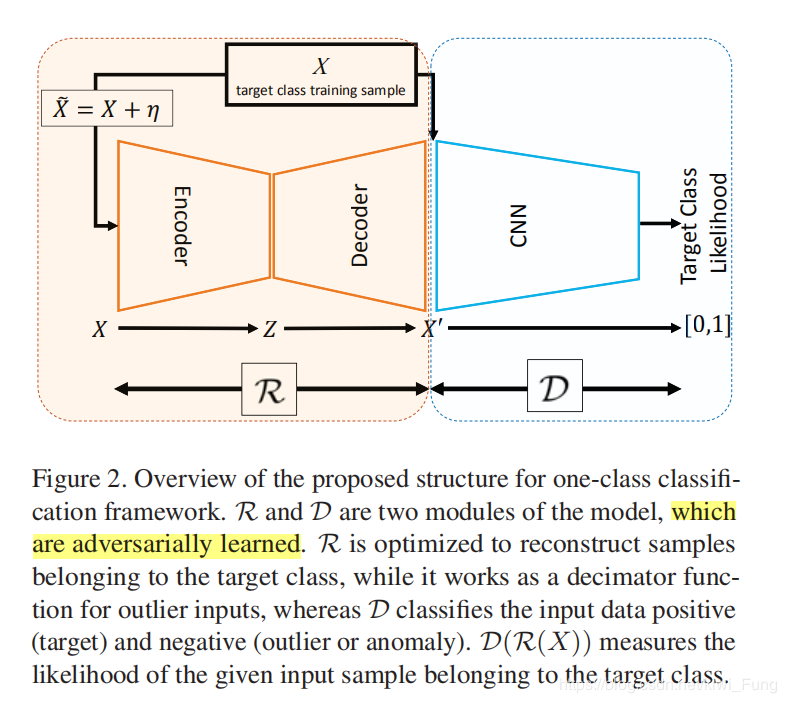

# One Class Classification（OOC）

分类问题中Novelty class 在训练中通常不存在，采样不良或定义不明确。而单分类器可以有效地模拟这些问题。

### Adversarially Learned One-Class Classifier for Novelty Detection

- #### Main Idea

  - 输入：实际的场景中，输入的图片会有各种噪音的(光照、摄像头等等因素)，因此，通过加噪可以增强数据，同时也增强分类器对于正常样本的边界的描绘能力。

  - 重建网络：通过`Conv-Autoencoder`来重构图像。正常样本能够在训练中，`Encoder`知道如何抽取合适的特征以让`Decoder`重构。非训练类，`Encoder`抽取的特征会较差，`Decoder`重构就会更差，误差逐层放大，那么非训练类经过这个`Auto-Encoder`得到的结果就会和原图差异较大。

  - 判决网络：最后加上`Discriminator`，意在通过类似`GAN`的对抗训练方式，一方面增强图片重构能力，另一方面增强分类的能力。将`Auto-Encoder`训练成一个健壮的`DeNoise-AutoEncoder`。

  这种操作能够产生针对目标类的特征提取与还原，并且在训练集上确保了这种操作不会被分类器所发现，也就是这种方法不会对后续判断造成误差。期望的是，测试集类似训练集，重构的误差较小，那么对于分类器的判断不会带来太大的误导信息。

- #### Structure

  

- #### 训练细节

  不过在论文的最后，作者也讨论了本模型与其他模型相比Err并没有下降很多。一方面是因为模型中RD网络训练的成功与否，主要有人为判断，只是简单的认为当D网络鉴别能力出现混淆是就认为模型训练工作的完成，另一方面是由于作者在数据集中加入10%的异常数据。

  

  

  我们可以看到文章的改进效果并不是非常大，应该还有提高的空间。
  由于训练是两个优化器进行的，什么时候终止训练，对于测试的效果是有影响的。本文采用的是当重构损失降到收敛就停。R+D两部分的训练方式的改进会对结果有一定的变化。两部分的共同训练，如果过早停止的话，那么权重还没调好。过晚停止的话就会导致鉴别器太强了，重构模块的损失将会主要是鉴别损失。所以我们会看到文中的设置鉴别器和重构采用的模块都是类似的，为的应该就是避免某一块过强。
  实验中尝试过混进异常内容进训练集，10%的outlier并没有导致模型的严重下降，EER只是下降了1.3%
  一个VAD的数据集，不需要时序，直接对帧进行操作就能够判别出异常。或许也能说明，这个数据集啊，其实时序信息好像并不见得很重要？Maybe to weak.

  会不会是测试集实在对抗性太弱了，如果提出更强的对抗性的样本能否让论文结果更加solid?

  