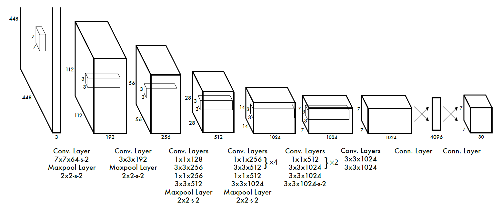
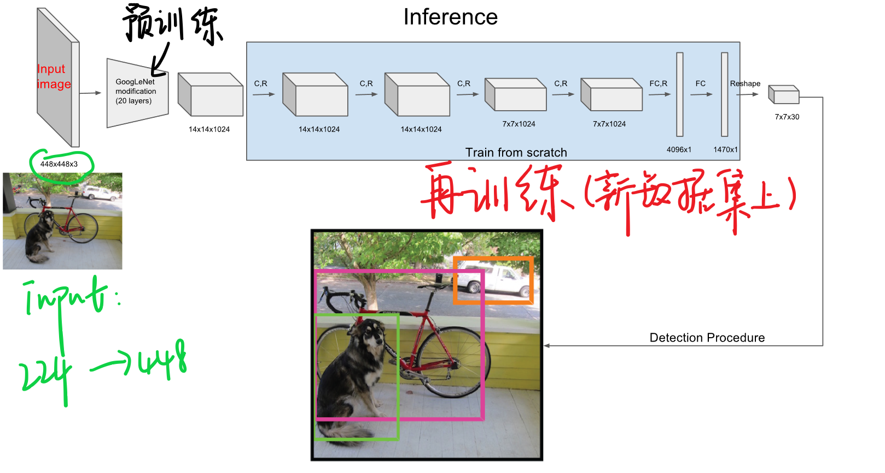
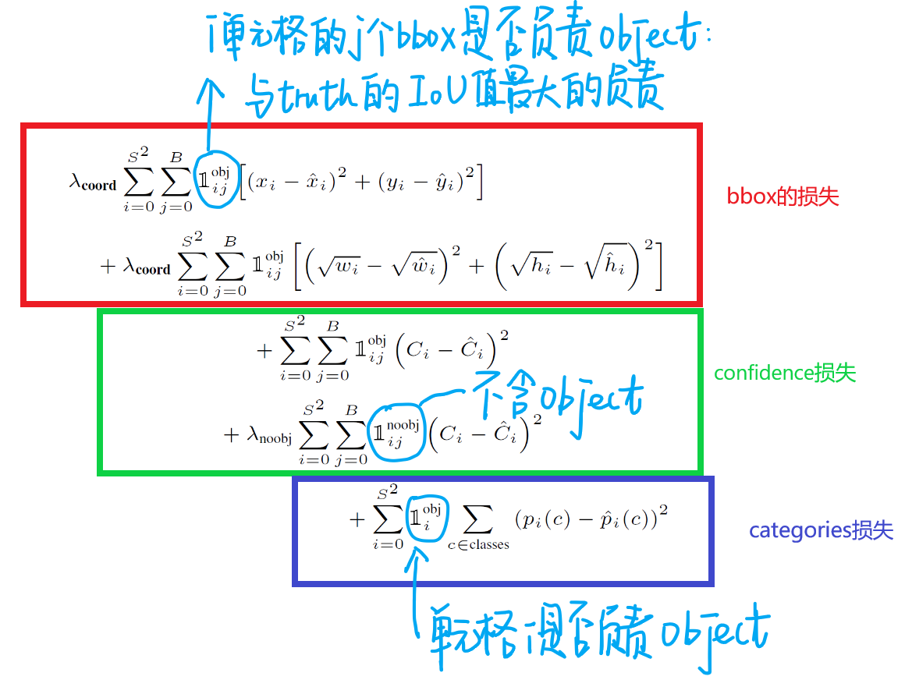
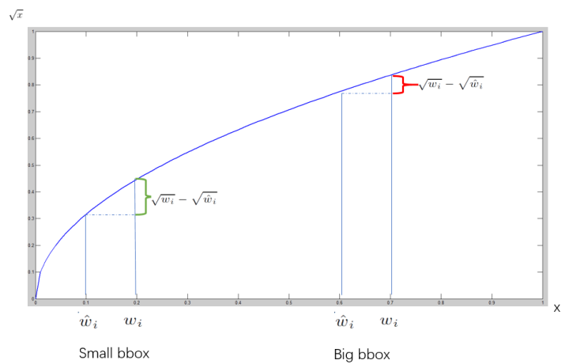
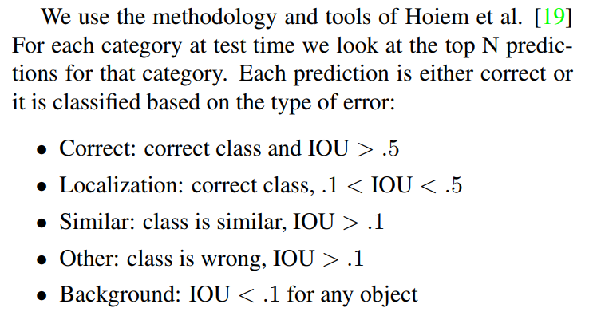
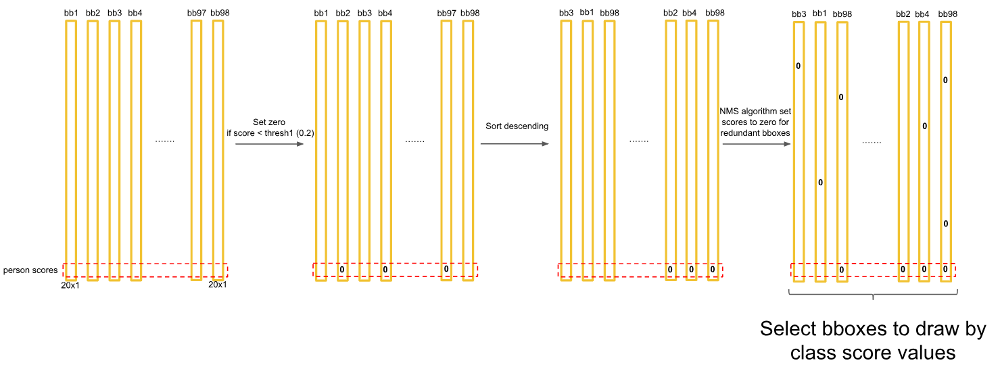

# One-Stage Object Detection

## YOLO

#### YOLO 特点 

1、速度快 

2、背景错误小，也就是使用了整张图，可以将全局信息包含在内，背景误判就会减少。 

3、泛化能力强，也就是说可以用到很多其他数据集上。 

**Ps**: YOLO 其实相当于将object detection框架设计为regression problem。 

YOLO是一个全新的方法，把一整张图片一下子应用到一个神经网络中去。网络把图片分成不同的区域，然后给出每个区域的边框预测和概率，并依据概率大小对所有边框分配权重。最后，设置阈值，只输出得分（概率值）超过阈值的检测结果。 

#### YOLO过程： 

1、将图片resize为448*448大小，增加细粒度的视觉信息。 

2、经过卷积网络和全连接网络转为最后7*7*30的特征。 

3、计算网络loss 

4、测试时用NMS丢弃框得到最终检测结果。

### 训练

##### 1、预训练

在ImageNet上进行，此时是用$224\times 224$大小，在YOLO训练中采用的$448 \times 448$大小，因此后面再连接四个卷积层和两个全连接最后reshape到（此处S是网格大小为7，B是bbox为2，C是confidence）:  $S\times S\times (B \times 5 + C)$

##### 2、训练中的loss

最终得到的$7\times 7\times 30$的向量中的每一条30维向量分别代表了两个bbox的$(x,y,w,h,confidence)$以及20类中的某一类。 

- b-box损失 

  x，y表示为在全图中的绝对位置，w和h取其根号形势进行，表示在w和h很大的时候，对其的检测误差波动容忍比较大，如果是小框条件下，w和h的稍许波动都是有更大影响的。也就是说，对不同大小的bbox预测中，相比于大bbox预测偏一点，小box预测偏一点更不能忍受。

  **$1_i^{obj}$表示第i个单元格内预测的第j个bbox是否负责这个object:在计算损失过程中，bbox与ground truth的IoU值最大的负责object。**

  

- confidence损失 
  $$
  Pr(Object) \times IOU^{truth}_{pred}
  $$
  可以看出在物体中心不落在网格中时，认为第二项为0，反之，则为1。当物体落在网格中时，得到的confidence是预测的bbox和ground truth的IOU作为结果。该步骤可以理解为让机器自动学习到IOU。 对于置信度的损失，是按照是否含有object情况下分成两部分，对于不包含object的单元格，我们使用λnoobj调整比例，防止这部分overpowering。

- category损失 

​	直接采用平方差的方式计算loss。

 

##### 3、训练中的其他细节 

- 在激活函数上

  最后一层使用的标准的线性激活函数，其他层使用的leaky rectified linear activation：
  $$
  \phi(x)=\begin{cases}
  x, & x > 0\\
  0.1x, & otherelse
  \end{cases}
  $$

- 在学习率上

  前75个epoch设置为$10^{-2}$、再30个epoch设置为$10^{-3}$、再30个epoch设置为$10^{-4}$

- 其他细节

  $batch=64,\quad momentum=0.9,\quad weight\ decay=0.0005, \quad dropout=0.5$

  以及数据增强。

- IOU细节

### 测试 

YOLO测试中，最终会得到7*7*2=98个预测框，同时也有其预测框中的带有的confidence，以及类别预测。 
$$
Pr(Class_i|Object)\times Pr(Object) \times IOU^{truth}_{pred}=Pr(Class_i)\times IOU^{truth}_{pred}
$$
实际测试判别中得到的confidence是由上面两部分构成的。 

最终结果是98个预测框，得到每个bbox的class-specific confidence score以后，设置阈值，滤掉得分低的boxes，对保留的boxes进行NMS处理，就得到最终的检测结果。

## YOLO-V2

 [论文:YOLO9000:Better, Faster, Stronger](https://arxiv.org/abs/1612.08242)