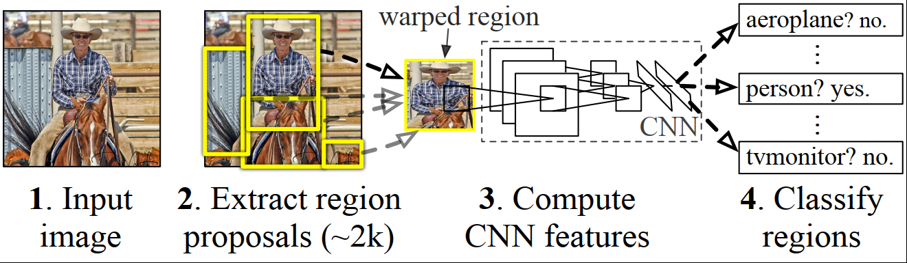
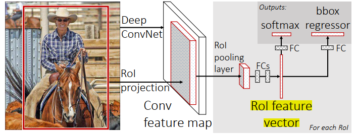
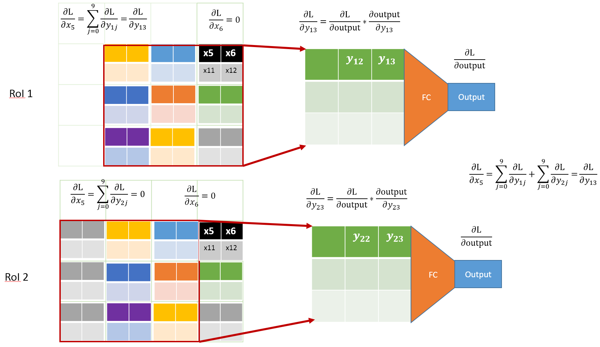
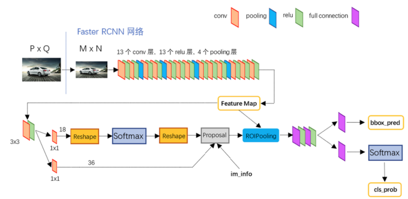
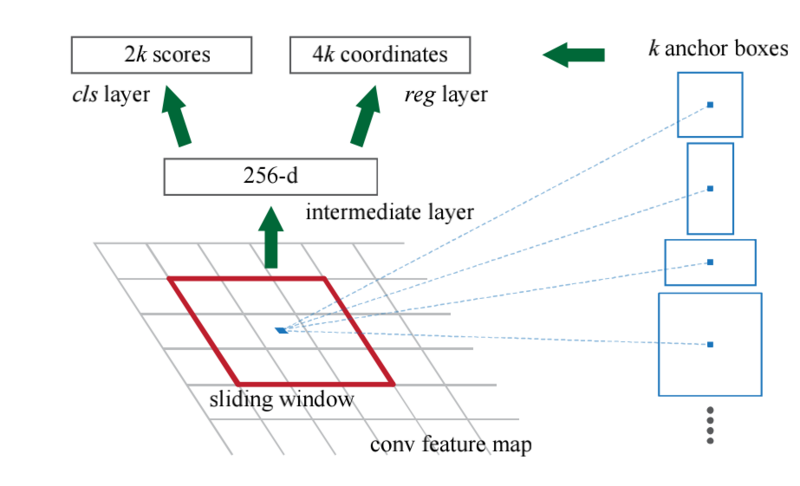

# Two-stage Object Detection

发展中的代表网络：

$RCNN \longrightarrow Fast\ RCNN\longrightarrow  Faster\ RCNN$

## R-CNN

#### 结构

1、Selective Search生成$1k-2k​$候选区域 

2、变换候选区域为$227×227$，利用AlexNet作为特征提取的网络，得到特征向量

3、采用SVM进行分类 

4、NMS剔除重叠回归框

5、采用回归器修正候选框位置，线性变换尽可能解决GT

#### 创新点 

(1) Apply high-capacity convolutional neural networks (CNNs) to bottom-up region proposals in order to localize and segment objects 。（CNN提取特征，AlexNet进行微调后得到特征）

(2) when labeled trainingdata is scarce, supervised pre-training for an auxiliary task, followed by domain-specific fine-tuning, yields a significant performance boost.  (大样本下有监督预训练+小样本微调的方式解决小样本难以训练甚至过拟合)

#### 训练过程： 

预训练 $\rightarrow$特定样本下微调(32正样本，96负样本) $\rightarrow$ SVM训练 $\rightarrow$ 回归器训练 

|        |                            正样本                            | 负样本                             |
| ------ | :----------------------------------------------------------: | ---------------------------------- |
| 预训练 |                          ILSVRC2012                          | ILSVRC2012                         |
| 微调   |        Ground Truth+与Ground Truth相交IoU>0.5的建议框        | 与Ground Truth相交IoU≤0.5的建议框  |
| SVM    |                         Ground Truth                         | 与Ground Truth相交IoU＜0.3的建议框 |
| 回归   | 与Ground Truth相交IoU最大的Region Proposal，并且IoU>0.6的Region Proposal |                                    |

#### 微调

不针对特定任务进行微调，而将CNN当成特征提取器，pool5层得到的特征是基础特征，类似于HOG、SIFT，类似于只学习到了人脸共性特征；从fc6和fc7等全连接层中所学习到的特征是针对特征任务特定样本的特征，类似于学习到了分类性别分类年龄的个性特征。 

- ###### 微调时和训练SVM时所采用的正负样本阈值【0.5和0.3】不一致？ 

  微调阶段是由于CNN对小样本容易过拟合，需要大量训练数据，故对IoU限制宽松：Ground Truth+与Ground Truth相交IoU>0.5的建议框为正样本，否则为负样本；  

  SVM这种机制是由于其适用于小样本训练，故对样本IoU限制严格：Ground Truth为正样本，与Ground Truth相交IoU＜0.3的建议框为负样本。 

### Remaining Problems 

[ ] 2k候选框计算累赘 

[ ] 不连续的测试和计算 

[ ] 重叠框无法共享特征，重复计算 

## Fast RCNN

1、生成候选区域ROI。训练输入2张图，每张图64个ROI，ROI特征向量包含了在原图中的空间位置信息。

2、imageNet进行预训练，归一化整个图片到$224×224$，输入神经网络到fc层之前的卷积层，用的VGG16网络。

3、输入候选区域ROI，将候选区域中进行roi max-pooling为固定大小。 

4、每个ROI pooling的结果经过两层fc层，分别经过两个并行的fc层进行softmax loss计算和bbox regressor。  

#### 创新点 

1、更快！！ 

2、太多的Region Proposal反而会损害Fast RCNN的准确度 

3、网络越深，softmax的效果高于SVM 

4、end2end + bb regressor > stage-wise+ bb regressor > end2end 

5、在训练更大的数据的时候，需要更多的iteration，更慢的learning rate decay

#### ROI pooling 定位原图的位置

从原图的位置推测出ROI对应feature map中的部分，划分为$H\times W$的格子。

其中 $\frac {\partial L}{\partial x_i}=\sum_r \sum_j[i=i^*(r, j)]\frac {\partial L}{\partial y_{rj}} \quad ROI\ gredient$

#### Loss函数——multi-task

$L(p,u,t^u,v)=L_{cls}(p,u)+\lambda[u\ge1]L_{loc}(t^u,v)$

$L_{cls}(p,u)=-log\ p_u\ is\ log\ loss\ for\ true\ class\ u​$

$L_{loc}(t^u,v)=\sum_{i \in \{x,y,w,h\}}\ smooth_{L_1}(t^u_i-v_i)$

$smooth_{L_1}=\begin{cases} 0.5x^2, & |x| \leq1\\ |x|-0.5, & otherwise\end{cases}$

$t^u=(t^u_x,t^u_y,t^u_w,t^u_h)$是预测的空间位置，$(v_x,v_y,v_w,v_h)$是真实的bounding-box

#### 最终训练样本

正样本：与bounding box有超过50%重叠率的 。

负样本：与bounding box重叠率位于0.1到0.5之间的 。

#### Truncated SVD加速全连接层运算 

## Faster-RCNN

#### 结构

1、Conv layers。Faster RCNN的feature maps被共享用于后续RPN层和全连接层。采用VGG-16 

2、**Region Proposal Networks**。RPN网络用于生成region proposals。该层通过softmax判断anchors属于foreground或者background，再利用bounding box regression修正anchors获得精确的proposals。 

（RPN网络实际分为2条线，上面一条通过softmax分类anchors获得foreground和background（检测目标是foreground），下面一条用于计算对于anchors的bounding box regression偏移量，以获得精确的proposal。而最后的Proposal层则负责综合foreground anchors和bounding box regression偏移量获取proposals，同时剔除太小和超出边界的proposals。） 

3、Roi Pooling。该层收集输入的feature maps和proposals，综合这些信息后提取proposal feature maps，送入后续全连接层判定目标类别。 

4、Classification。利用proposal feature maps计算proposal的类别，同时再次bounding box regression获得检测框最终的精确位置。 

[File](./files/Faster RCNN.pdf)

#### 创新点：

全部计算可以采用GPU运行，提出了Reign Proposal Network（RPN） 

RPN和Fast RCNN共享卷积层。使用fine-tuning在训练区域判断任务和已确定区域的Fast-RCNN中进行交替迭代 

#### RPN training 

**训练数据**：mini-batch中正负样本为1:1，总共256张，正样本为与ground truth的IoU最高以及IoU > 0.7 如果正样本不足则用负样本补充。 

 **训练过程**：交替迭代训练（我们首先训练RPN，然后使用这些proposals来训练F-RCNN ，之后再使用参数初始化RPN，如此迭代） 

###### Faster-RCNN中anchor的概念 

anchor实际上是在扫过的每一个sliding Windows中，中心和Windows相同的，尺度不同的 