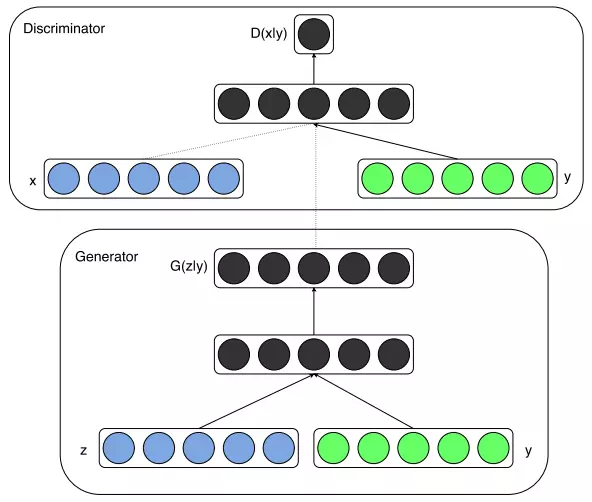
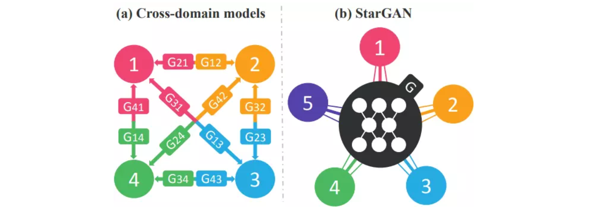

# GAN

论文地址是[Generative Adversarial Nets](https://arxiv.org/pdf/1406.2661.pdf)，提出了GAN模型的基本结构和优化目标。基本结构包括两个网络结构——生成模型Generator和判别模型Discriminator。G网络尽可能生成满足正样本分布的假样本，而D网络则尽可能辨别出真假样本，在这个博弈过程中2种网络的性能都越来越好。GAN模型结构如下：

网络要优化的目标是
$$
\min _{G} \max _{D} V(D, G)=E_{x \sim p_{d a t a}(x)}[\log D(x)]+E_{z \sim p_{z}}(z)[\log (1-D(G(z)
$$
具体一点就是对于G网络而言优化目标
$$
L=\log (1-\operatorname{sigmoid}(D(G(z)))
$$
对于D网络而言优化目标
$$
L=-\log (\operatorname{sigmoid}(D(x))
$$
  初代GAN模型有个很大的缺陷在于训练很困难，一不小心loss就会变成NaN。G网络和D网络的训练必须要处于一个平衡过程，如果一方训练得太好，就会导致另外一方无法训练下去（loss太小，反向传播梯度过小导致训练无法进行下去）。

### Pros & Cons:

#### Pros:

- GANs are a good method for training classifiers in a semi-supervised way. See our [NIPS paper](https://arxiv.org/abs/1606.03498) and the accompanying [code](https://github.com/openai/improved-gan). You can just use our code directly with almost no modification any time you have a problem where you can’t use very many labeled examples. 
- **The parameter update of G is not directly from data sample, but uses backpropagation from D.**
- GANs **generate samples faster** than fully visible belief nets (NADE, PixelRNN, WaveNet, etc.) because there is no need to generate the different entries in the sample sequentially.
- GANs don’t need any Monte Carlo approximations to train. That means it can **generate more details and high dimensional features and when it works it works well** . People complain about GANs being unstable and difficult to train, but they are much easier to train than Boltzmann machines, which relied on Monte Carlo approximations to the gradient of the log partition function. Because Monte Carlo methods don’t work very well in high dimensional spaces, Boltzmann machines have never really scaled to realistic tasks like ImageNet. GANs are at least able to learn to draw a few messed up dogs when trained on ImageNet.
- Compared to variational autoencoders, GANs **don’t introduce any deterministic bias which cause the blur pictures**. Variational methods introduce deterministic bias because they optimize a lower bound on the log-likelihood rather than the likelihood itself. This seems to result in VAEs learning to generate blurry samples compared to GANs.
- **Compared to nonlinear ICA** (NICE, Real NVE, etc being the most recent examples), there is no requirement that the latent code have any specific dimensionality or that the generator net be invertible.
- **Compared to VAEs**, it’s easier to use discrete latent variables.
- **Compared to Boltzmann machines and GSNs**, generating a sample requires only one pass through the model, rather than an unknown number of iterations of a Markov chain.

#### Cons:

- Training a GAN requires finding a Nash equilibrium of a game. Sometimes gradient descent does this, sometimes it doesn’t. We don’t really have a good equilibrium finding algorithm yet, so **GAN training is unstable** compared to VAE or PixelRNN training.
- It’s **hard to learn to generate discrete data**, like text.
- Compared to Boltzmann machines, it’s hard to do things like guess the value of one pixel given another pixel. GANs are really trained to do just one thing, which is generate all the pixels in one shot. You can fix this by using a BiGAN, which lets you guess missing pixels using Gibbs sampling, the same as in a Boltzmann machine.

## DCGAN

  论文地址是[UNSUPERVISED REPRESENTATION LEARNING WITH DEEP CONVOLUTIONAL GENERATIVE ADVERSARIAL NETWORKS](https://arxiv.org/pdf/1511.06434.pdf)，该文章从实践的角度对初代GAN模型提出了一些改进：

1. 用大步长的convolutional layer替代pooling layer
2. 在D网络和G网络中均使用batch normalization
3. 去掉全连接层
4. G网络中的激活函数使用ReLU，最后一层使用Tanh
5. D网络中的激活函数使用LeakyReLU

## CGAN

  论文地址是[Conditional Generative Adversarial Nets](https://arxiv.org/pdf/1411.1784.pdf)，提出了给D网络和G网络的输入加入辅助信息，这样G网络的输出就是可控的，而不像初代GAN模型那样输出是随机的。CGAN的优化目标是：
$$
\min _{G} \max _{D} V(D, G)=E_{x \sim p_{d a t a}(x)}[\log D(x | y)]+E_{z \sim p_{z}(z)}[\log (1-D(G(z | y))
$$
对应的网络模型结构如下：

## InfoGAN

  论文地址是[InfoGAN: Interpretable Representation Learning by Information Maximizing Generative Adversarial Nets](https://arxiv.org/pdf/1606.03657.pdf)，论文出发点和CGAN相似，InfoGAN也提出了加入新信息（论文中称为latent code）来控制G网络的具体输出。不过在训练方式上InfoGAN和CGAN不一样，CGAN只是将条件信息直接拼接在输入噪音信息和真实信息上，而InfoGAN则是额外创建了一个网络用来保证G网络的输出和真实样本之间的互信息最大化。InfoGAN的优化目标是:
$$
\min _{G} \max _{D} V(D, G)=E_{x \sim p_{\text {data}}(x)}[\log D(x)]+E_{z \sim p_{z}}(z)[\log (1-D(G(z)))]
$$
其中，$I(c;G(z,c))$就是G网络输出和相应类别之间的互信息损失。$I(c;G(z,c))=H(c)-H(c|G(z,c))$难以优化，因为我们不知道后验概率$P(c|x)$（x是G网络的输出，我们是没法知道训练过程中G网络输出与$c$之间的概率关系），所以InfoGAN采用变分推断的思想，用一个可调的已知分布去尽可能靠近未知的后验概率分布$P(c|x)$，就是保证新加入的模型的输出向量和c对应的向量的交叉熵尽可能小。

## LSGAN

[Least Squares Generative Adversarial Networks](https://arxiv.org/pdf/1611.04076.pdf) LSGAN指出初代GAN模型的损失函数很可能导致梯度消失问题，所以将辨别器采用最小乘方的损失函数方法，因为这种方法可以惩罚离正确的决策边缘远的地方的样本，同时，最小化目标函数比最小化Pearson $χ^2$ divergence更好。

最小二乘GAN，目标函数将是一个平方误差，考虑到D网络的目标是分辨两类，如果给生成样本和真实样本分别编码为$a,b$，那么采用平方误差作为目标函数，D的目标就是

$\mathop{min}_D L(D)=E_{x \sim p_x}(D(x)-b)^2+E_{z \sim p_z}(D(G(z)-a)^2$

G的目标函数将编码$a$换成编码$c$，这个编码表示D将G生成的样本当成真实样本，可以看做，$a$是G网络输出对应的label，$b$是真实样本对应的label，$c$是G网络希望D网络对虚假样本的判别值

$\mathop{min}_G L(G)=E_{z \sim p_z}(D(G(z)-c)^2$

在下一节我们会证明，当$b-c=1, b-a=2$时，目标函数等价于皮尔森卡方散度$Pearson\ \chi^2divergence$。一般来说，取$a=-1, b=1, c=0$或者$a=-1, b=c=1$。在理论上证明了least square loss对于拉近$p_g$和$p_{data}$的有效性。

对于类别很多的任务，LSGAN结合CGAN设计了一个新的LSGAN结构，此时模型的优化目标是

$\begin{align} \min_D V_{LSGAN}(D) &= \frac{1}{2}E_{x \sim p_{data}(x)}[(D(x|\Phi(y))-1)^2]+\frac{1}{2}E_{z \sim p_z(z)}[(D(G(z)|\Phi(y)))^2] \\ \min_G V_{LSGAN}(G) &= \frac{1}{2}E_{z \sim p_z(z)}[(D(G(z)|\Phi(y)))^2] \end{align}$

## WGAN(WGAN-GP)

  WGAN论文地址是[Wasserstein GAN](https://arxiv.org/pdf/1701.07875.pdf)，WGAN-GP论文地址是[Improved Training of Wasserstein GANs](https://arxiv.org/pdf/1704.00028.pdf)。WGAN的主要工作是从理论上证明了传统GAN模型的loss给训练带来的弊端，并提出新的基于wasserstein distance（也称为推土机距离）的loss函数，而WGAN-GP则是对WGAN提出的一点改进再次进行了改进。具体如下：

1. WGAN提出了4点改进： 
   1. 判别器最后一层去掉sigmoid
   2. 生成器和判别器的loss不取log
   3. 每次更新**判别器**的参数之后把它们的绝对值截断到不超过一个固定常数c
   4. 不要用基于动量的优化算法（包括momentum和Adam），推荐RMSProp，SGD也行
2. WGAN-GP则是对上面的第3点提出改进，提出用梯度惩罚来代替梯度裁剪

WAGN中D网络[（代码）](https://github.com/tensorflow/tensorflow/blob/master/tensorflow/contrib/gan/python/losses/python/losses_impl.py#L118)和G网络[（代码）](https://github.com/tensorflow/tensorflow/blob/master/tensorflow/contrib/gan/python/losses/python/losses_impl.py#L78)的优化目标是

$$\begin{align} \min_D V_{WGAN}(D) &= -E_{x \sim p_{data}(x)}[D(x)]+E_{z \sim p_z(z)}[D(G(z))] \\ \min_G V_{WGAN}(G) &= -E_{z \sim p_z(z)}[D(G(z))] \\ \end{align}$$

而WGAN-GP的优化目标是

$$\begin{align} \min_D V_{WGAN}(D) &= -E_{x \sim p_{data}(x)}[D(x)]+E_{z \sim p_z(z)}[D(G(z))]+\lambda E_{x \sim p_{\hat{x}}}[||\nabla_xD(x)||_p-1]^2 \\ \min_G V_{WGAN}(G) &= -E_{z \sim p_z(z)}[D(G(z))] \end{align}$$

其中Gradient penalty的实现可看[代码](https://github.com/tensorflow/tensorflow/blob/master/tensorflow/contrib/gan/python/losses/python/losses_impl.py#L304)。如果想更加详细的了解WGAN和WGAN-GP，可以看下面这两篇博客：

1. [令人拍案叫绝的Wasserstein GAN](https://zhuanlan.zhihu.com/p/25071913)
2. [Wasserstein GAN最新进展：从weight clipping到gradient penalty，更加先进的Lipschitz限制手法](https://www.zhihu.com/question/52602529/answer/158727900)
3. [Wasserstein GAN](https://lotabout.me/2018/WGAN/)

解决的问题：

1. 极大的“在数值上”减弱了梯度消失的问题，而且其损失函数的值可以用来指示训练过程(此处我说“在数值上”是因为在考虑是否可以做“探索梯度组成和意义的研究，进而想到新的梯度来源和更精细、更准确的梯度更新机制，比如哪层更新哪层”)；
2. 虽然在同样的架构下WGAN-GP与DCGAN生成的图片效果差不多，但是WGAN-GP更具健壮性，别的距离产生的损失函数针对不同的数据集需要精心设计架构、使用技巧和G-D训练比例，否则会崩溃，但是WGAN-GP基本上都可以训练好，这个也是WGAN-GP在工程实现上更加流行的原因，相比于其他论文结果复现能力和泛化能力更加强大；
3. 至于mode collapse，论文中作者仅仅提及根据实验结果应该是解决了

注意：

1. 判别器最后一层去掉sigmoid函数。因为原始GAN的判别器做的是真假二分类任务，所以最后一层是sigmoid，但是现在WGAN-GP中的判别器做的是近似拟合Wasserstein距离，属于回归任务，所以要把最后一层的sigmoid拿掉。
2. 判别器的模型架构中不能使用Batch Normalization，由于我们是对每个样本独立地施加梯度惩罚，Batch Normalization会引入同个batch中不同样本的相互依赖关系。如果需要的话，可以选择其他normalization方法，如Layer Normalization、Weight Normalization和Instance Normalization，这些方法就不会引入样本之间的依赖。论文推荐的是Layer Normalization。

总结：

Wasserstein Distance 是一个更好的距离度量，它最终可以转化为优化问题，我们需要找出一个判别器 DD，并要求它满足 1-Lipschitz1-Lipschitz。实际使用时我们并做不到这一点，于是有两种方法来近似：weight clipping 和 gradient penalty。

## ACGAN

[Conditional Image Synthesis with Auxiliary Classifier GANs](https://arxiv.org/pdf/1610.09585.pdf)，ACGAN做的工作就是将CGAN和InfoGAN结合起来。ACGAN中G网络的输入是将噪音和label拼接起来（CGAN），有$X_{\text {fake }}=G(c, z)$，同时设计了一个辅助分类网络对真假样本进行分类（InfoGAN），可见ACGAN是将辅助信息使用到了极致。ACGAN模型的优化目标如下：
$$
\begin{align} L_S &= E[\log P(S=real|X_{real})]+E[\log P(S=fake|X_{fake})] \\ L_C &= E[\log P(C=c|X_{real})]+E[\log P(C=c|X_{fake})] \end{align}
$$
其中，通过最大化$L_C+L_S$来训练D网络，最大化$L_C-L_S$来训练G网络。ACGAN的实现可看[代码](https://github.com/tensorflow/tensorflow/blob/master/tensorflow/contrib/gan/python/train.py#L221)。ACGAN并没有多少理论上的创新性改进，但是它在ImageNet上做了大量的实验，如下：

1. 合成不同分辨率的图像并计算其可判别性，发现当合成图像分辨率越高时质量也越高（将合成图像传入到Inception网络中，高分辨率合成图像其对应的准确率越高，从而反映了图片质量越高）。
2. 使用MS-SSIM来衡量生成图像的多样性。[结构相似性](https://zh.wikipedia.org/zh-cn/結構相似性)（structure similarity）原本是衡量两张图片相似性的指标，这里作者将其用来衡量生成图像的多样性，MS-SSIM值越低说明生成的图像多样性越高。
3. 对合成图片的Inception模型输出准确性和相应的MS-SSIM值进行了分析，发现如果GAN模型输出的合成图片多样性越高，那么这些图片的Inception模型的准确率也要高一些。
4. 探索了模型是否过拟合（是学会了相关图片的分布还是只是“记住了”训练图片）。最简单的方法就是从训练集中找到“距离”合成图片最近的真实图片，发现这些真实图片并不能代表合成图片，说明了模型不是只是“记住了”真实图片的分布。作者还提出了其他验证方法，一种是对模型的潜在空间进行线性插值，看是否会出现discrete transition（个人理解就是插值后的图片很不连贯），另外一种就是保持输入的额外信息不变，看合成图片对应的Inception模型输出的类别（大部分类别都不一样说明模型没有过拟合）。
5. 探索了类别数量对模型性能的影响，如果训练集中真实图片所属类别越多，那么最后模型的MS-SSIM值也相对越高，也就是合成图片更加单调，但是论文中指出增加模型参数可以改善这个影响。（个人意见）我认为这说明了要想合成更多不同种类且多样化的图片，还是需要更大的模型才行。

## CycleGAN

[Unpaired Image-to-Image Translation using Cycle-Consistent Adversarial Networks](https://arxiv.org/pdf/1703.10593.pdf)，CycleGAN在结构上做了很大的改进，CycleGAN是将两个普通GAN模型结合起来进行训练，两个GAN模型的G网络输入都是真实图片（不再是噪音）。CycleGAN所做的工作就是对两类真实图片进行图像风格迁移，将G网络输入的真实图片的风格转换成另外一种图片的风格。此时模型优化目标是

$L(G,F,D_X,D_Y) = L_{GAN1}(G,D_Y,X,Y)+L_{GAN2}(F,D_X,Y,X)+\lambda L_{cyc}(G,F)$

其中，$X$和$Y$是两类不同风格的图片，模型$GAN1$是将输入图片X的风格转换成图片Y的风格，模型$GAN2$是将输入图片$Y$转换成图片$X$的风格。上式中一、二项都是GAN模型的损失，而第三项是论文的关键——循环一致性损失。首先看下该损失对应的公式：

$L_{cyc}(G,F)=E_{x \sim p_{data}(x)}[||F(G(x))-x||_1]+E_{y \sim p_{data}(y)}[||G(F(y))-y||_1]$

单看第一项，数据$x$输入到$GAN1$的生成网络中，并将输出结果输入到$GAN2$的生成网络中，最后计算输出结果与原始数据x的距离。第二项做的工作也是一样的。对这一项进行优化就是要保证图片经过两次转换后发生的变化尽可能小，其实就是为了保证生成网络能更好的拟合风格X到风格Y之间和风格Y到风格X之间的映射关系，防止GAN模型的合成图片太单调（mode collapse）。Cycle loss的实现可见[代码](https://github.com/tensorflow/tensorflow/blob/master/tensorflow/contrib/gan/python/losses/python/losses_impl.py#L939) 。CycleGAN的模型表示如下：

## StarGAN

[StarGAN: Unified Generative Adversarial Networks for Multi-Domain Image-to-Image Translation](https://arxiv.org/pdf/1711.09020.pdf)，StarGAN的任务是多领域的图到图的翻译（multi-domain image-to-image translation），改进是将多个GAN模型统一为一个（unified generative adversarial networks）。具体改进如下图：

（a）图中，假设base model选择是CycleGAN，那么共需要$4 \times 3/2=6$个base model，但是（b）图中的StarGAN只需要一个就可以完成不同领域的图片的转换。StarGAN模型结构图如下：

我的理解：StarGAN模型就是带有condition的CycleGAN，模型中G网络的输入不再是$x$，而是带有condition的$(x,c)$。模型中D网络输出向量组成和目标检测one-stage模型的输出组成很像，都有置信度和类别信息，不同点在于目标检测中置信度用于判断box中是否含有object，而这里置信度判断输入图片是real还是fake。同时为了保证图到图的转换过程中保留了输入图片的content，StarGAN的loss中也加入了CycleGAN的cycle loss。StarGAN模型的优化目标如下：

$$
\begin{align} L_D &=-L_{adv}+\lambda_{cls}L_{cls}^r \\ L_G &=L_{adv}+\lambda_{cls} L_{cls}^f+\lambda_{rec}L_{rec} \end{align}
$$
其中有，
$$
\begin{align} L_{adv} &= E_x[\log D_{src}(x)]+E_{x,c}[\log (1-D_{src}(G(x,c)))] \\ L_{cls}^r &= E_{x,c^{'}}[-\log D_{cls}(c^{'}|x)] \\ L_{cls}^f &= E_{x,c}[-\log D_{cls}(c|G(x,c))] \\ L_{rec} &= E_{x,c,c^{'}}[||x-G(G(x,c),c^{'})||_1] \end{align}
$$
但是在实际实现中StarGAN将原始GAN的loss改为WGAN-GP的loss，也就是：

$$
L_{adv} = E_x[D_{src}(x)]-E_{x,c}[D_{src}(G(x,c))]-\lambda_{gp}E_{\hat{x}}[(||\nabla_{\hat{x}}D_{src}(\hat{x})||_2-1)^2]
$$
**StarGAN中是怎么将$c$和输入图片拼接起来的？**$c$拼接在噪音向量后面，但是StarGAN的输入是图片，那么如何$c$拼接到3维图片信息中呢？

