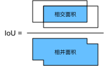

# 目标检测基础

## 概念

- #### Bounding-box

  在目标检测里，我们通常使用边界框（bounding box）来描述目标位置。边界框是一个矩形框，可以由矩形左上角的$x$和$y$轴坐标与右下角的$x$和$y$轴坐标确定。

- #### ground-truth

  目标检测算法通常会在输入图像中采样大量的区域，然后判断这些区域中是否包含我们感兴趣的目标，并调整区域边缘从而更准确预测目标的真实边界框（ground-truth bounding box）

- #### anchor 

  不同的模型所使用的区域采样方法可能不同，有一种方法：它以每个像素为中心生成多个大小和宽高比（aspect ratio）不同的边界框。这些边界框被称为锚框（anchor box）

- #### NMS

  在模型预测阶段，我们先为图像生成多个锚框，并为这些锚框一一预测类别和偏移量。随后，我们根据锚框及其预测偏移量得到预测边界框。当锚框数量较多时，同一个目标上可能会输出较多相似的预测边界框。为了使结果更加简洁，我们可以移除相似的预测边界框。常用的方法叫做非极大值抑制（non-maximum suppression，简称NMS）。

  ###### 工作原理：

  对于一个预测边界框$B$，模型会计算各个类别的预测概率。设其中最大的预测概率为$p$，该概率所对应的类别即$B$的预测类别。我们也将$p$称为预测边界框$B$的置信度。在同一图像上，我们将预测类别非背景的预测边界框按置信度从高到低排序，得到列表$L$。从$L$中选取置信度最高的预测边界框$B_1$作为基准，将所有与$B_1$的交并比大于某阈值的非基准预测边界框从$L$中移除。这里的阈值是预先设定的超参数。此时，$L$保留了置信度最高的预测边界框并移除了与其相似的其他预测边界框。
  接下来，从$L$中选取置信度第二高的预测边界框$B_2$作为基准，将所有与$B_2$的交并比大于某阈值的非基准预测边界框从$L$中移除。重复这一过程，直到$L$中所有预测边界框都曾作为基准。此时$L$中任意一对预测边界框的交并比都小于阈值。最终，输出列表$L$中的所有预测边界框。

- #### 标签

  在训练集中，我们为每个锚框标注两类标签：一是锚框所含目标的类别；二是真实边界框相对锚框的偏移量。

- #### [mAP](https://github.com/rafaelpadilla/Object-Detection-Metrics)

  目标检测中用来衡量检测结果的重要参数之一。

- 

- 

## 基本方法

### 生成多个锚框

假设输入图像高为$h$，宽为$w$。我们分别以图像的每个像素为中心生成不同形状的锚框。设大小为$s\in (0,1]$且宽高比为$r > 0$，锚框的宽和高分别为$ws\sqrt{r}$和$hs/\sqrt{r}$。当中心位置给定时，已知宽和高的锚框是确定的。

下面我们分别设定好一组大小$s_1,\ldots,s_n$和一组宽高比$r_1,\ldots,r_m$。如果以每个像素为中心时使用所有的大小与宽高比的组合，输入图像将一共得到$whnm$个锚框。虽然这些锚框可能覆盖了所有的真实边界框，但计算复杂度容易过高。因此，我们通常只对包含$s_1$或$r_1$的大小与宽高比的组合感兴趣，即

$$(s_1, r_1), (s_1, r_2), \ldots, (s_1, r_m), (s_2, r_1), (s_3, r_1), \ldots, (s_n, r_1).​$$

也就是说，以相同像素为中心的锚框数量为$n+m-1$。对于整个输入图像，我们将一共生成$wh(n+m-1)$个锚框。

生成多个图后，找出图像中以（250，250）为中⼼的所有锚框。可以看到，⼤小为 0.75 且宽⾼⽐为 1 的蓝⾊锚框较好地覆盖了图像中的狗。 

### 交并比

我们刚刚提到某个锚框较好地覆盖了图像中的狗。如果该目标的真实边界框已知，这里的“较好”该如何量化呢？一个直观的方法是衡量锚框和真实边界框之间的相似度。Jaccard系数（Jaccard index）可以衡量两个集合相似度。给定集合$\mathcal{A}$和$\mathcal{B}$，它们的Jaccard系数即二者交集大小除以二者并集大小：

$$J(\mathcal{A},\mathcal{B}) = \frac{\left|\mathcal{A} \cap \mathcal{B}\right|}{\left| \mathcal{A} \cup \mathcal{B}\right|}.$$

实际上，我们可以把边界框内的像素区域看成是像素的集合。如此一来，我们可以用两个边界框的像素集合的Jaccard系数衡量这两个边界框的相似度。当衡量两个边界框的相似度时，我们通常将Jaccard系数称为交并比（Intersection over Union，简称IoU），即两个边界框相交面积与相并面积之比，如图9.2所示。交并比的取值范围在0和1之间：0表示两个边界框无重合像素，1表示两个边界框相等。

在本节的剩余部分，我们将使用交并比来衡量锚框与真实边界框，以及锚框与锚框之间的相似度。

### 多尺度目标检测

以输入图像的每个像素为中心生成多个锚框，这些锚框是对输入图像不同区域的采样。然而，如果以图像每个像素为中心都生成锚框，很容易生成过多锚框而造成计算量过大。

减少锚框个数有一个简单的方法是在输入图像中均匀采样一小部分像素，并以采样的像素为中心生成锚框。此外，在不同尺度下，我们可以生成不同数量和不同大小的锚框。值得注意的是，较小目标比较大目标在图像上出现位置的可能性更多。举个简单的例子：形状为$1 \times 1$、$1 \times 2$和$2 \times 2$的目标在形状为$2 \times 2$的图像上可能出现的位置分别有4、2和1种。因此，当使用较小锚框来检测较小目标时，我们可以采样较多的区域；而当使用较大锚框来检测较大目标时，我们可以采样较少的区域。

在神经网络中的目标检测，当不同层的特征图在输⼊图像上分别拥有不同大小的感受野时，它们将分别用来检测不同大小的目标。例如，我们可以通过设计网络，令较接近输出层的特征图中每个单元拥有更广阔的感受野，从而检测输入图像中更大尺寸的目标。 我们用输入图像在某个感受野区域内的信息来预测输入图像上与该区域相近的锚框的类别和偏移量。

### [mAP](https://github.com/rafaelpadilla/Object-Detection-Metrics)

首先有几个概念：

$TP: True\ Positive, \quad TN:True\ Negtive,\quad FP: False\ Positive, \quad FN:False\ Negtive$

$Presicion=\frac {TP}{TP+FP}, \quad Recall=\frac{TP}{TP+FN}$

$mAP=mean(AP), \quad where \ AP \ is \ about \ each\ class.$

下面举个例子说明：

以下是目标检测的结果，红色为结果框，绿色为ground truth。

结合上面的结果可以列出下面一个排序，根据框中的置信度。

画出各点在坐标轴上的位置:

下面有两种方法可以求得$AP​$结果有所差异。

第一种方法可以求得：

$A_1=(0.0666-0)\times1=0.0666, \quad A_2=(0.1333-0.0666)\times0.6666=0.04446,​$

$A_3=(0.4-0.1333)\times0.4285=0.11428, \quad A_4=(0.4666-0.4)\times0.3043=0.02026 ​$

$AP=A_1+A_2+A_3+A_4=0.245609=24.56\%​$

第二种方法：

$AP=\frac{1}{11}(1+0.6666+0.4285+0.4285+0.4285+0+0+0+0+0+0+0)=24.84\%$

