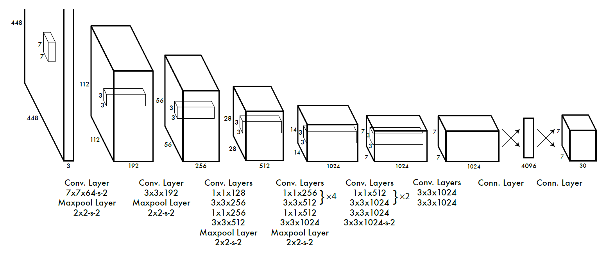
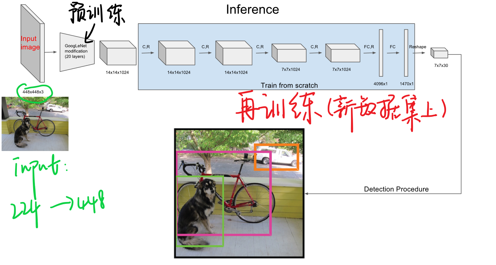
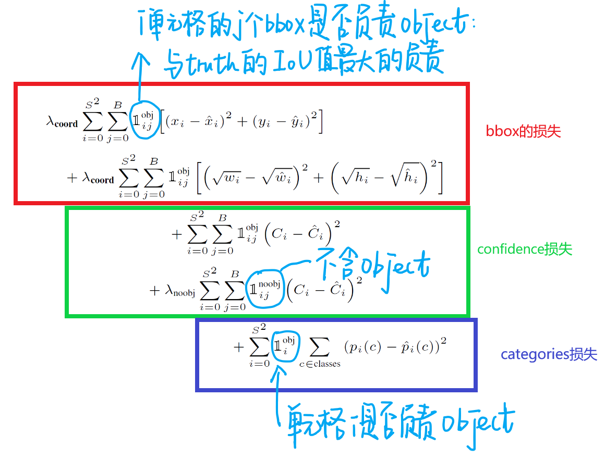
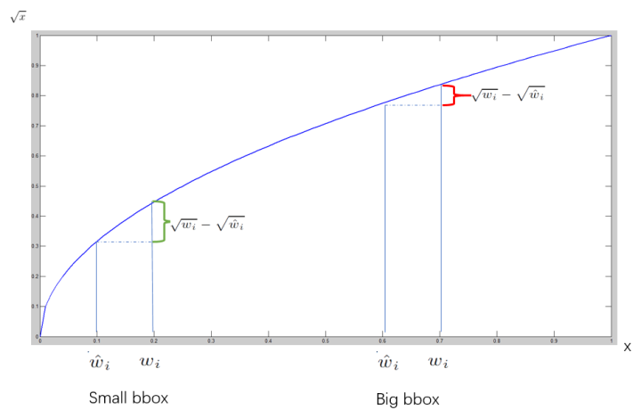
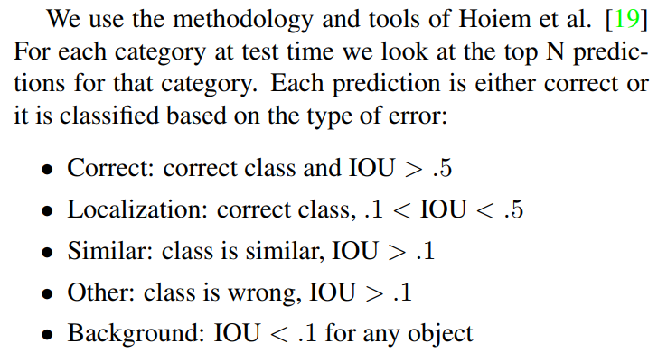
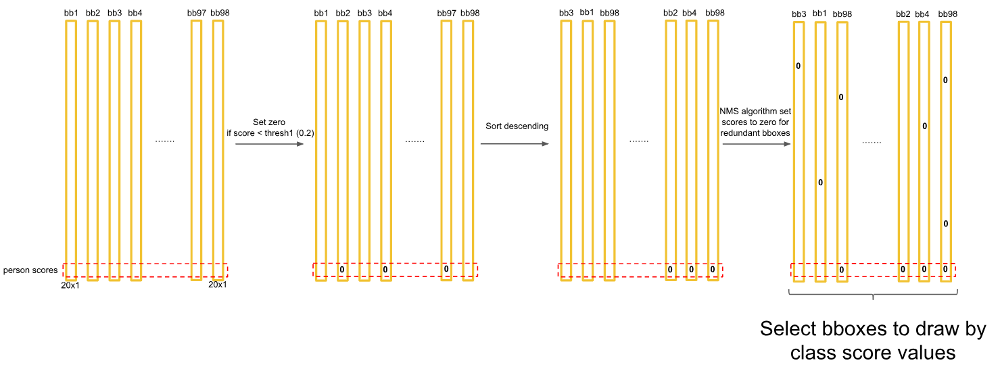

# One-Stage Object Detection

## YOLO

#### YOLO 特点 

1、速度快 

2、背景错误小，也就是使用了整张图，可以将全局信息包含在内，背景误判就会减少。 

3、泛化能力强，也就是说可以用到很多其他数据集上。 

**Ps**: YOLO 其实相当于将object detection框架设计为regression problem。 

YOLO是一个全新的方法，把一整张图片一下子应用到一个神经网络中去。网络把图片分成不同的区域，然后给出每个区域的边框预测和概率，并依据概率大小对所有边框分配权重。最后，设置阈值，只输出得分（概率值）超过阈值的检测结果。 

#### YOLO过程： 

1、将图片resize为448*448大小，增加细粒度的视觉信息。 

2、经过卷积网络和全连接网络转为最后7*7*30的特征。 

3、计算网络loss 

4、测试时用NMS丢弃框得到最终检测结果。

### 训练

##### 1、预训练

在ImageNet上进行，此时是用$224\times 224$大小，在YOLO训练中采用的$448 \times 448$大小，因此后面再连接四个卷积层和两个全连接最后reshape到（此处S是网格大小为7，B是bbox为2，C是confidence）:  $S\times S\times (B \times 5 + C)$

##### 2、训练中的loss

最终得到的$7\times 7\times 30$的向量中的每一条30维向量分别代表了两个bbox的$(x,y,w,h,confidence)$以及20类中的某一类。 

- b-box损失 

  x，y表示为在全图中的绝对位置，w和h取其根号形势进行，表示在w和h很大的时候，对其的检测误差波动容忍比较大，如果是小框条件下，w和h的稍许波动都是有更大影响的。也就是说，对不同大小的bbox预测中，相比于大bbox预测偏一点，小box预测偏一点更不能忍受。

  **$1_i^{obj}$表示第i个单元格内预测的第j个bbox是否负责这个object:在计算损失过程中，bbox与ground truth的IoU值最大的负责object。**

  

- confidence损失 
  $$
  Pr(Object) \times IOU^{truth}_{pred}
  $$
  可以看出在物体中心不落在网格中时，认为第二项为0，反之，则为1。当物体落在网格中时，得到的confidence是预测的bbox和ground truth的IOU作为结果。该步骤可以理解为让机器自动学习到IOU。 对于置信度的损失，是按照是否含有object情况下分成两部分，对于不包含object的单元格，我们使用λnoobj调整比例，防止这部分overpowering。

- category损失 

​	直接采用平方差的方式计算loss。

 

##### 3、训练中的其他细节 

- 在激活函数上

  最后一层使用的标准的线性激活函数，其他层使用的leaky rectified linear activation：
  $$
  \phi(x)=\begin{cases}
  x, & x > 0\\
  0.1x, & otherelse
  \end{cases}
  $$

- 在学习率上

  前75个epoch设置为$10^{-2}$、再30个epoch设置为$10^{-3}$、再30个epoch设置为$10^{-4}$

- 其他细节

  $batch=64,\quad momentum=0.9,\quad weight\ decay=0.0005, \quad dropout=0.5$

  以及数据增强。

- IOU细节

### 测试 

YOLO测试中，最终会得到$7 \times 7 \times 2=98$个预测框，同时也有其预测框中的带有的confidence，以及类别预测。 
$$
Pr(Class_i|Object)\times Pr(Object) \times IOU^{truth}_{pred}=Pr(Class_i)\times IOU^{truth}_{pred}
$$
实际测试判别中得到的confidence是由上面两部分构成的。 

最终结果是98个预测框，得到每个bbox的class-specific confidence score以后，设置阈值，滤掉得分低的boxes，对保留的boxes进行NMS处理，就得到最终的检测结果。

## YOLO-V2

 [论文:YOLO9000:Better, Faster, Stronger](https://arxiv.org/abs/1612.08242)

### Better

##### 1. BN

在网络的每个卷积层后增加Batch Norm，同时弃用了dropout，网络的上升了2%mAP.

##### 2. High Resolution Classifier

$448\times 448$，并在前10个epoch上进行分辨率的微调为了适应更高的分辨率。​

##### 3. Convolutional With Anchor Boxes

去掉YOLO的FC层，同时去掉YOLO的最后一个pool层，增加feature map的分辨率，修改网络的输入，保证f**eature map有一个中心点，这样可提高效率**。并且是以每个anchor box来预测物体种类的。最后的feature map大小为$13\times 13$​​在每个pixel上面使用9个anchor boxs，后面选取了5个候选的anchor boxs。

##### 4. Dimension Clusters

采用K-means聚类方法来自动选择最佳的初始boxes。在训练集的图片标签上做一个聚类操作，聚类算法为：

$d(box, centroid)=1-IOU(box, centroid)$

将所有候选框进行聚类，选定5个为候选的anchor box，作为先验信息，提升检测的准确率。

##### 5. Direct location prediction  

相比于Faster RCNN和SSD对位置信息采用偏移量预测的方法。yolo2采用直接预测位置信息的方法。

$$
b_x=\sigma(t_x)+c_x, \ \ b_y = \sigma(t_y)+c_y, \ \ b_w = p_we^{t_w}, \ \ b_h = p_he^{t_h}, \ \ Pr(object) *IOU(b, object)=\sigma(t_o)
$$
其中，$c_x, c_y,p_w, p_h$​​ 为聚类后5个anchor box的先验信息。

##### 6. Fine-Grained Features  

采用passthrough的方法增加细粒度细节，将浅层的$26 \times 26$ 的特征图谱映射到$13 \times 13$的特征域上，增加细粒度特征。

##### 7.Multi-Scale Training.  

以32为基数，将输入图片转换成不同尺度大小的图片，去掉全连接层，每10个epoch更换一次训练尺度，使得网络能够适用于从$320 \times 320$到$608 \times 608$的不同尺度的目标检测任务。

### Faster

##### 1. less parameters - Darknet

借鉴VGG网络构建了19层的特征提取网络Darknet，融合NIN将卷积网络转换为轻量级卷积，充分提取特征。

##### 2. multi-tast training

同时训练分类和检测，也可以分来训练两个任务，任务之间相辅相成，提升分类和检测效果。

### Stronger

##### 1. jointly training datas

##### 2. Hierarchical classification

建立一个层级的树状知识概念结构，将COCO和ImageNet中的所有分类作为语料建立WordTree。构造yolo9000可以实现在COCO上进行检测，也可以在ImageNet上进行分类。在高层分类的监督标签置信度较高，越低的类别置信度低。

## YOLO-v3

##### 1. Multilabel Classification

由于开源数据集上有很多标签类别是重叠的，比如人和女人的标签是重叠的，因此，移除softmax，改用binary cross-entropy损失进行类别预测。

##### 2. Predictions Across Scales  

预测3个不同尺度的bbox，采用类似feature pyramid networks（FPN），在最后输出层为3D的tensor输出bbox，位置

##### 3. Darknet-53

增加了残差层的darknet，提高了提特征网络的层数，提取更深层特征。

## SSD

SSD结合了YOLO和anchor的特点。更快，准确率更高。SSD是对anchor进行直接的分类和bbox回归。下面是SSD的结构图。

