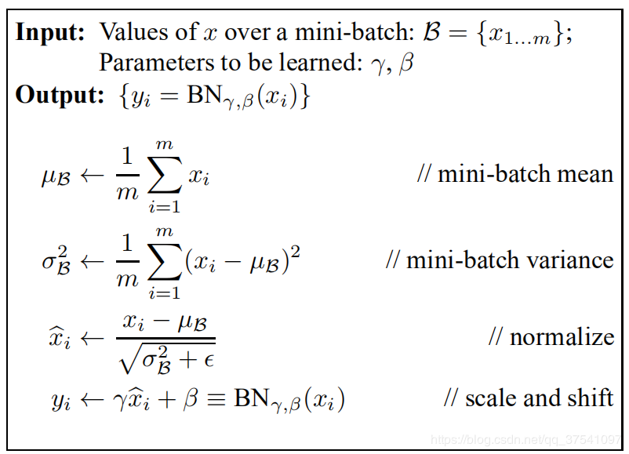
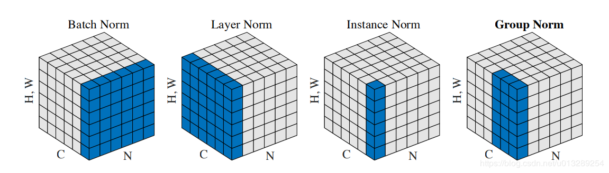

# 算法工程师面试

## 深度学习 

### 模型评估方法

#### Accuracy作为指标有哪些局限性？

> 当正负样本极度不均衡时存在问题！当正负样本不均衡时，常用的评价指标为ROC曲线和PR曲线。

#### ROC曲线和PR曲线各是什么？

> 受试者工作特征曲线（Receiver Operating Characteristic，ROC）
> ROC关注两个指标：
> 1） True Positive Rate ( TPR ) = TP / [ TP + FN] ，TPR代表能将正例分对的概率
> 2）False Positive Rate( FPR ) = FP / [ FP + TN] ，FPR代表将负例错分为正例的概率
>
> PR（Precision - Recall）曲线 
> 准确率（Precision，P）：P = TP / (TP + FP)
> 召回率（Recall，R）：R = TP/ (TP + FN)
> **PR曲线实则是以precision（精准率）和recall（召回率）这两个为变量而做出的曲线，其中recall为横坐标，precision为纵坐标。**
> 平衡点（BEP）是P=R时的取值，如果这个值较大，则说明学习器的性能较好。而F1 = 2 * P * R ／( P + R )，同样，F1值越大，我们可以认为该学习器的性能较好。
> ROC曲线由于兼顾正例与负例，所以适用于评估分类器的整体性能，相比而言PR曲线完全聚焦于正例。
>
> True Positive, TP: 预测为正样本，实际也为正样本
> False Positive, FP: 预测为正样本，实际为负样本
> True Negative, TN: 预测为负样本，实际也为负样本
> False Negative, FN: 预测为负样本，实际为正样本

#### 编程实现AUC的计算，并指出复杂度？

> 有两种计算AUC的方法:
> 1.绘制ROC曲线，ROC曲线下面的面积就是AUC的值
> 2.假设总共有（m+n）个样本，其中正样本m个，负样本n个，总共有mn个样本对，计数，正样本预测为正样本的概率值大于负样本预测为正样本的概率值记为1，累加计数，然后除以（mn）就是AUC的值
> 
> ```python
> def calc_auc(y_labels, y_scores):
>  f = list(zip(y_scores, y_labels))
>  rank = [values2 for values1, values2 in sorted(f, key=lambda x:x[0])]
>  rankList = [i+1 for i in range(len(rank)) if rank[i] == 1]
>  pos_cnt = np.sum(y_labels == 1)
>  neg_cnt = np.sum(y_labels == 0)
>  auc = (np.sum(rankList) - pos_cnt*(pos_cnt+1)/2) / (pos_cnt*neg_cnt)
>  print(auc)
> ```
>
> 排序复杂度：$O(log2(P+N))$
>
> 计算AUC的复杂度：$O(P+N)$

#### AUC指标有什么特点？放缩结果对AUC是否有影响？

> **AUC (Area under Curve)：ROC曲线下的面积，作为数值可以直观的评价分类器的好坏，值越大越好。**
> $ AUC = 1$，是完美分类器，采用这个预测模型时，存在至少一个阈值能得出完美预测。绝大多数预测的场合，不存在完美分类器。
>  $0.5 < AUC < 1$，优于随机猜测。这个分类器（模型）妥善设定阈值的话，能有预测价值。
>  $AUC = 0.5$，模型没有预测价值
>
> 放缩结果对$AUC$没有影响

#### 余弦距离与欧式距离有什么特点？

> 余弦距离$cos\theta=\frac{<x,y>}{||x||||y||}$
>
> 欧氏距离： $d(x,y)=\sqrt{\sum_{i=0}^N(x_i-y_i)^2}$
>
> 余弦距离，也称为余弦相似度，是用向量空间中两个向量夹角的余弦值作为衡畺两个个体间差异的大小的度量。如果两个向量的方向一致，即夹角接近零，那么这两个向量就相近。
>
> 余弦距离使用两个向量夹角的余弦值作为衡是两个个体间差异的大小。
>
> 相比欧氏距离，余弦距离更加注重两个向量在方向上的差异。当对向量进行归一化后，欧式距离与余弦距离一致。

### 基本方法

#### 如何划分训练集？如何选取验证集？

> - 通常80%为训练集，20%为测试集
> - 当数据量较小时的时候将训练集、验证集以及测试集划分为6：2：2；若是数据很大，可以将训练集、验证集、测试集比例调整为98：1：1
> - 当数据量很小时，可以采用K折交叉验证
> - 划分数据集时可采用随机划分法（当样本比较均衡时），分层采样法（当样本分布极度不均衡时）

#### 什么是偏差和方差？

> 偏差：描述预测值的期望与真实值之间的差别，偏差越大说明模型的预测结果越差。
>
> 方差：描述预测值的变化范围。方差越大说明模型的预测越不稳定。
>
> 高方差过拟合，高偏差欠拟合。

#### 什么是过拟合？深度学习解决过拟合的方法

> 过拟合是指模型拟合了训练样本中的噪声，导致泛化能力差。
>
> - 增加训练数据，增加数据多样性
> - 缩减模型表达能力，L1,L2正则化
> - Dropout
>- 训练时提前终止
> - 集成多种模型
>- BN
> 

#### 解决欠拟合的方法有哪些？

> 增加模型复杂度、调整模型初始化方式、调整学习率、集成多种模型

#### 深度模型参数调整的一般方法论

> 重要性：学习率>正则值>dropout
>
> - 学习率：遵循小->大->小原则
> - 初始化：选择合适的初始化方式，有预训练模型更好
> - 优化器选择：adam比较快，sgd较慢
> - loss：回归问题选L2 loss，分类问题选交叉熵
> - 可视化
> - 从小数据大模型入手，先过拟合，再增加数据并根据需要调整模型复杂度

### 优化方法

#### 简述了解的优化器，发展综述？

> $SGD \rightarrow Momentum\rightarrow NAG \rightarrow AdaGrad \rightarrow RMSProp \rightarrow Adam$ 
>
> $SGD : \theta = \theta-\alpha \nabla_{\theta}L$
>
> $Momentum: \theta = \theta+v \quad s.t.\ v=\beta v+\alpha \nabla_{\theta}L$ 定义了速度，更新不光取决于当前梯度，且保持了惯性。
>
> $AdaGrad (adaptive \ gradient):\theta=\theta-\alpha \bigodot g \quad s.t. \ \alpha = \frac{\alpha}{\delta+\sqrt{r}} \quad r = r+g \bigodot g$  通过过往的梯度累计，自动调节学习率。其中$g$为之前更新的参数梯度列表。
>
> $RMSProp: r = pr+(1-p)g \bigodot g$  累计梯度加权平均。
>
> $Adam:\theta = \theta-\alpha \frac{v}{\sqrt{r}+\epsilon} \quad s.t. \ r = pr+(1-p)g \bigodot g  \quad v=(1-\alpha)v+\alpha g$    
>
> Adam结合了动量，自适应学习率这两个特性，而这两个特性也叫一阶和二阶矩估计。
>


#### 常用的损失函数有哪些？分别适用于什么场景？

> - 分类损失：
>   - Log Loss：
>   - cross-entropy loss：$L(Y|f(X))=$
>   - Focal Loss
>   - KL divergence(Relative Entropy)
>   - Exponential Loss：$L(Y|f(X))=exp(-ylogf(x))$ 对离群点和噪声敏感
> - Hinge Loss：$L(Y|f(X))=max(0, 1-yf(x))$ 0点不可导，不能用梯度下降。
>
> - 回归损失：
>   - MSE(Mean Square Error)：$L(Y|f(X))=\sum_N(y-f(x))^2$ 当预测值距离真是只越远时，平方损失函数的惩罚力度越大，因此对异常点比较敏感。
>   - MAE(Mean Absolute Error)：$L(Y|f(X))=\sum_N|f(x)-y|$  绝对损失函数相当于在做中值回归，相比做均值回归的平方损失函数，绝对损失函数对异常点更鲁棒。但在f=y处无法求导。
>   - Huber Loss： $L(Y|f(X))=\begin {cases} \sum_N(f(x)-y)^2, |f(x)-y|< \delta \\ \sum_N|f(x)-y|, |f(x)-y|>\delta \end{cases}$Huber损失函数在|f-y|较小时为平方损失，在|f-y|较大的时采用线性损失，处处可导，且对异常点鲁棒。

#### 交叉熵、相对熵、log损失

> cross-entropy loss： $L(Y|f(X))=\sum_Nylogf(x)+(1-y)log(1-f(x))$ 
>
> relative-entropy loss：
>
> log loss：


#### 梯度下降与拟牛顿法的异同？

> 梯度下降和牛顿法的推导均与泰勒公式有关：
>
> 泰勒公式：$f(x)=\sum^{\infty}_{n=0} \frac{f^{(n)}(x_0)}{n!}(x-x_0)^n$ 
>
> ​				若 $x^t=x^{t-1}+\Delta x$ ，则$f(x^t)$ 在 $x^{t-1}$ 处的泰勒展开为：
>
> ​				$f(x^t)=f(x^{t-1}+\Delta x) \simeq f(x^{t-1})+f'(x^{t-1})\Delta x+f''(x^{t-1})\frac{{\Delta x}^2}{2}$
>
> 
>
> 1. 参数更新模式相同
>
> 2. 梯度下降法利用误差的梯度来更新参数，拟牛顿法利用海塞矩阵的近似来更新参数
>
> 3. 梯度下降是泰勒级数的一阶展开，而拟牛顿法是泰勒级数的二阶展开
>
> 4. SGD能保证收敛（神经网络中），但是L-BFGS在非凸时不收敛。
>
> 5. 梯度下降法收敛慢，迭代次数多，牛顿法收敛快，迭代次数少。
>
> 6. 梯度下降可以用在特征维度较大的场景，牛顿法用在特征较少。

#### L1和L2正则分别有什么特点？为何L1稀疏？

> #### 稀疏性
>
> <div style="float:left;border:solid 1px 000;margin:2px;"></div><div style="float:left;border:solid 1px 000;margin:2px;"></div>
>
> 上图，每一个等值线和正则图形第一次相交的解为最优解。对于L1而言，最优解是在尖角，因此会存在参数为0的情况，由此产生稀疏模型，从而进行特征选择，而L2正则化相交的点为零的概率小，因此不具有稀疏性
>
> **稀疏性**，说白了就是模型的很多参数是0。通常机器学习中特征数量很多，例如文本处理时，如果将一个词组（term）作为一个特征，那么特征数量会达到上万个（bigram）。在预测或分类时，那么多特征显然难以选择，但是如果代入这些特征得到的模型是一个稀疏模型，很多参数是0，表示只有少数特征对这个模型有贡献，绝大部分特征是没有贡献的，即使去掉对模型也没有什么影响，此时我们就可以只关注系数是非零值的特征。这相当于对模型进行了一次特征选择，只留下一些比较重要的特征，提高模型的泛化能力，降低过拟合的可能。
>
> #### 过拟合
>
> 拟合过程中通常希望参数的权值尽可能小，参数
>
> $P-Norm: ||x||_p:=(\sum^n_{i=1}|x_i|^p)^{\frac{1}{p}}$
>
> $L1$ 对异常点更具有鲁棒性、在0处不可导，计算不方便，没有唯一解，输出稀疏
>
> $L2$ 计算方便，对异常点敏感，有唯一解。
>
> 在梯度更新时，不管 $L1 $的大小是多少（只要不是0）梯度都是1或者-1，所以每次更新时，它都是稳步向0前进。从而导致$L1$输出稀疏
>

### 深度学习基础

#### 以一层隐层的神经网络，relu激活，MSE作为损失函数推导反向传播

### 激活函数的作用

> 增加非线性、增加特征组合。

### 数据归一化

> 数据归一化后**，最优解的寻优过程明显会变得平缓，更容易正确的收敛到最优解。**

#### NN的权重参数能否初始化为0？

> 不能，可能导致模型无法收敛，**w初始化全为0，很可能直接导致模型失效，无法收敛。*****不管进行多少轮正向传播以及反向传播，每俩层之间的参数都是一样的。**
>
> **因此可以对w初始化为随机值解决（在cnn中，w的随机化，也是为了使得同一层的多个filter，初始w不同，可以学到不同的特征，如果都是0或某个值，由于计算方式相同，可能达不到学习不同特征的目的）**

#### 什么是梯度消失和梯度爆炸？

> - 梯度消失：
>   - 如果每一层神经元对上一层的输出的偏导乘上权重结果都小于1的话，那么在经过足够多层传播之后，误差对输入层的偏导会趋于0。这种情况会导致靠近输入层的隐含层神经元调整极小。
>   - ReLU、BN
>   - 残差网络结构
> - 梯度爆炸：
>   - 如果每一层神经元对上一层的输出的偏导乘上权重结果都大于1的话，在经过足够多层传播之后，误差对输入层的偏导会趋于无穷大。这种情况又会导致靠近输入层的隐含层神经元调整变动极大。
>   - 梯度裁剪：设置一个梯度剪切阈值，更新梯度时，若梯度超过阈值，就将其强制限制在这个范围之内
>   - 正则化：通过正则化可以限制权值范数，通过正则化项，可以部分限制梯度爆炸的发生。
>   - ReLU、BN

#### 常用的激活函数，导数？

> 激活函数的条件：非线性、处处可微等。激活函数给神经元引入了非线性因素，使得神经网络可以任意逼近任何非线性函数，这样神经网络就可以应用到众多的非线性模型中。
>
> - Sigmoid：$\sigma(x)=\frac{1}{1+e^{-x}} \quad \sigma'(x)=\sigma(x)(1-\sigma(x))$
> - Tanh：$tanh(x) = \frac{e^{x}-e^{-x}}{e^{x}+e^{-x}} \quad tanh'(x)=1-tanh^2(x)$
> - ReLU：$y = max(0, x) \quad y'=\begin{cases} 0, x<0\\ 1, x \ge 0 \end{cases}$
> - Leak-ReLU：$y =\begin{cases} \alpha x, x<0\\ x, x \ge 0 \end{cases} \quad y'=\begin{cases} \alpha, x<0\\ 1, x \ge 0 \end{cases}$
> - SoftPlus：$y=log(1+e^x) \quad y'=\sigma(x)$

#### relu的有优点？又有什么局限性？他们的系列改进方法是啥？

> Relu的主要贡献在于：解决了梯度消失、爆炸的问题、计算方便，计算速度快、加速了网络的训练、在负半区的导数为0，造成了网络的稀疏性，**缓解过拟合**
>
> 同时也存在一些缺点：
>
> 1. 由于负数部分恒为0，会导致一些神经元无法激活（可通过设置小学习率部分解决）
> 2. 输出不是以0为中心的
>
> Leak-ReLU解决了relu的0区间带来的影响，而且包含了relu的所有优点。

#### sigmoid和tanh为什么会导致梯度消失？

> 当神经元的激活在接近0或1处时会饱和，在这些区域，梯度几乎为0。在反向传播的时候，这个（局部）梯度将会与整个损失函数关于该门单元输出的梯度相乘。如果局部梯度非常小，那么相乘的结果也会接近零，从而导致梯度消失，权重无法更新。为了防止饱和，必须对于权重矩阵初始化特别留意。比如，如果初始化权重过大，那么大多数神经元将会饱和，导致网络就几乎不学习了。

#### 一个隐层需要多少节点能实现包含n元输入的任意布尔函数？

> 

#### 多个隐层实现包含n元输入的任意布尔函数，需要多少节点和网络层？

> 

#### dropout为何能防止过拟合？

> - 首先随机（临时）删掉网络中一定数量的隐藏神经元，输入输出神经元保持不变
> - 把输入x通过修改后的网络前向传播，然后把得到的损失结果通过修改的网络反向传播。按照随机梯度下降法更新（没有被删除的神经元）对应的参数（w，b）。
> - 恢复被删掉的神经元（被删除的神经元保持原样，被删除的神经元已经有所更新）重复这一过程。
>
> - 取平均的作用： 假设用相同的训练数据去训练5个不同的神经网络，一般会得到5个不同的结果，此时我们可以采用 “5个结果取均值”或者“多数取胜的投票策略”去决定最终结果。这种“综合起来取平均”的策略通常可以有效防止过拟合问题。因为不同的网络可能产生不同的过拟合，取平均则有可能让一些“相反的”拟合互相抵消。dropout不同的隐藏神经元就类似在训练不同的网络，整个dropout过程就相当于对很多个不同的神经网络取平均，可以达到整体上减少过拟合。
> - 减少神经元之间复杂的共适应关系： 因为dropout程序导致两个神经元不一定每次都在一个dropout网络中出现。（这样权值的更新不再依赖于有固定关系的隐含节点的共同作用，阻止了某些特征仅仅在其它特定特征下才有效果的情况）。 迫使网络去学习更加鲁棒的特征 （这些特征在其它的神经元的随机子集中也存在）。
>
> dropout是在全连接层——延伸dropblock是在卷积层，是卷积网络的专属正则化（dropout在conv上效果不好的原因：conv具有空间相关性，做drop会有信息流向后面的网络，导致dropout不彻底。）

#### dropout和BN 在前向传播和方向传播阶段的区别

> **Batch Normalization**，就是在深度神经网络训练过程中使得每一层神经网络的输入保持相近的分布。
>
> - 在训练时，是对每一批的训练数据进行归一化，也即用每一批数据的均值和方差。
>   - 求解输入向量每一维度特征的均值和方差；
>   - 对每一维度特征就行0均值，1方差进行归一化；
>   - 引入可学习参数**γ**和**β**，对归一化后的结果进行缩放(scale)和平移(shift)操作。
> - 在测试时，用的均值和方差是全量训练数据的均值和方差，这个可以通过移动平均法求得。
>   - $E(x) \leftarrow E_{B}(\mu_B) \quad Var(x) \leftarrow \frac{m}{m-1} E_B(\sigma^2_B)$
>   - $y=\gamma (\frac{x-E(x)}{\sqrt{Var(x)+\epsilon}})+\beta$
>
> **但是**，实际求解均值E[x]和方差Var[x]计算量较大，在实际软件框架实现中，采用滑动平均法(Moving Average)来近似求解E[x]和Var[x]。即在训练阶段，每更新一次参数，都顺便按照滑动平均法更新均值和方差，最终训练过程结束后得到的均值和方差就用来代替这里的E[x]和方差Var[x]。
>
> 滑动平均按照如下公式计算：shadow_variable（cur） = decay * shadow_variable（pre） + (1 - decay) * variable，decay是人为设定的衰减率参数，shadow_variable（cur）相当于当前轮次训练的参数更新，它等于上一轮次的参数更新*衰减率+当前轮次计算出的参数取值*（1-衰减率）。这里所说的参数就是均值和方差，当前计算出的参数取值就是当前伦次训练过程中计算出的batch的均值和方差。（具体什么是滑动平均，自行百度）
>
> 当一个模型训练完成之后，它的所有参数都确定了，包括均值和方差，gamma和bata。
>
> BN训练**不用全量训练集的均值和方差**：因为用全量训练集的均值和方差容易过拟合，对于BN，其实就是对每一批数据进行归一化到一个相同的分布，而每一批数据的均值和方差会有一定的差别，而不是用固定的值，这个差别实际上能够增加模型的鲁棒性，也会在一定程度上减少过拟合。BN一般要求将训练集完全打乱，并用一个较大的batch值，否则，一个batch的数据无法较好得代表训练集的分布，会影响模型训练的效果。
>
> **Dropout**
> Dropout 是在训练过程中以一定的概率的使神经元失活，即输出为0，以提高模型的泛化能力，减少过拟合。
>
> Dropout 在训练时采用，是为了减少神经元对部分上层神经元的依赖，类似将多个不同网络结构的模型集成起来，减少过拟合的风险。在测试时，应该用整个训练好的模型，因此不需要dropout。

- LR

#### 初始化方式

#### BN的优点

> 1. 子网络的输入分布会随着前段网络参数变化而改变（ICS问题），这会导致该子网络在每次参数更新够需要去适应新的输入分布，会难以训练。batchnorm保证的子网络的输入分布稳定
> 2. 在激活层前加batch norm有利于使输入处于激活函数的非饱和区，这样就允许使用tanh和sigmoid等饱和区大的激活函数了（之前激活函数饱和带来的梯度消失问题是通过把激活函数改成ReLU以及精细的参数初始化来解决的）
> 3. 特征的梯度尺度不再依赖于参数的初始化，可以允许使用更大的学习率，加快了网络收敛
> 4. 一定程度上是一种正则化，样本x随着batch1进行训练时，经过batchnorm的均值、方差为u1、v1，随着batch2进行训练时，经过batchnorm的均值、方差为u2，v2，可以防止网络对单个样本x的过拟合

#### 交叉熵公式，已知p和y，写代码计算交叉熵

> 二分类交叉熵公式：$L = -\frac{1}{n}\sum_i^n[(1-p)log(1-y)+plogy]$
>
> 多分类交叉熵公式：$L=-\frac{1}{n}\sum_i^n\ \sum^m_j p_j^ilog\ y^i_j$ ，其中 $i$ 为样本id，$j$ 为类别id

#### 为什么最小化交叉熵可以实现分类

> - **信息熵是消除不确定性所需信息量的度量。**信息熵就是信息的不确定程度，信息熵越小，信息越确定。$信息熵=∑^n_{x=1}(信息x发生的概率×验证信息x需要的信息量) \rightarrow\ H(X)=-\sum_xp(x)log(p(x))$ 为事件发生的可能性。
>
> - 相对熵：对于随机变量 $x$ 有两个独立的概率分布 $p(x)$ 和 $q(x)$。相对熵为衡量两个分布的差异，也称为KL散度：$D_{KL}(p||q) = \sum_{i=1}^np(x_i)log\frac{p(x_i)}{q(x_i)}$  越小，$D_{KL}(p||q)$ 越小，表示p(x)和q(x)的分布越近。
>
> 交叉熵：$H(p, q)=-\sum_{i=1}^np(x_i)log(q(x_i))$ 
>
> 根据相对熵推导 $D_{KL}(p||q)= \sum_{i=1}^np(x_i)log(p(x_i))- \sum_{i=1}^np(x_i)log(q(x_i)) =  H(p, q)-H(X)$
>
> 在最小化交叉熵过程中，设定分布 $p(x)$ 为真实分布，而 $q(x)$ 为模型的预测分布。优化两个分布的距离可以从优化交叉熵中实现。并且交叉熵形式更简洁，计算方便。

#### 极大似然估计

> 二分类情况下：设预测为某一个类别的概率分别为：$P(X=1)=p, \ P(X=0)=1-p$，由此可得概率预测函数为：$P(X)=p^X(1-p)^{1-X}$，数据集中采样得到数据集D，可以统计到$X$和$1-X$，但是$p$值未知。建立对数似然函数根据D来求出$P$：$logP(D)=log \prod^{N}_iP(D_i)=\sum_i logP(D_i)=\sum_i(D_ilogp+(1-D_i)log(1-p))$
>
> 得到公式后，在公式前加一个负号便和交叉熵一致。可以通过求导得到最小值点来求得极大似然估计值：
>
> $\sum_i(D_i\frac{1}{p}+(1-D_i)\frac{1}{1-p})=0 \quad \rightarrow \quad p=\frac{1}{N}\sum D_i$

#### bn怎么计算，其他Norm方式相比bn的特点和优势

> 
>
> 对于BN，mean计算的是每一个长宽和batch的平均值，若输入bs为16的图片，维度为$5\times5\times128$ 的特征，mean的维度为128维。
>
> 不同的Norm方式：
>
> 
>
> - Batch Normalization：
>   - BN的计算就是把每个通道的NHW单独拿出来归一化处理
>   - 针对每个channel我们都有一组γ,β，所以可学习的参数为2*C
>   - 当batch size越小，BN的表现效果也越不好，因为计算过程中所得到的均值和方差不能代表全局
>
> - Layer Normalizaiton：
>   - LN的计算就是把每个CHW单独拿出来归一化处理，不受batchsize 的影响
>   - 常用在RNN网络，但如果输入的特征区别很大，那么就不建议使用它做归一化处理
>
> - Instance Normalization
>   - IN的计算就是把每个HW单独拿出来归一化处理，不受通道和batchsize 的影响
>   - 常用在风格化迁移，但如果特征图可以用到通道之间的相关性，那么就不建议使用它做归一化处理
>
> - Group Normalizatio
>   - GN的计算就是把先把通道C分成G组，然后把每个gHW单独拿出来归一化处理，最后把G组归一化之后的数据合并成CHW
>   - GN介于LN和IN之间，当然可以说LN和IN就是GN的特列，比如G的大小为1或者为C
>
> - Switchable Normalization：将 BN、LN、IN 结合，赋予权重，让网络自己去学习归一化层应该使用什么方法，训练复杂


### LR和softmax+cross entropy有什么区别

> softmax公式：$softmax(x_i)=\frac{e^{x_i}}{\sum^n_je^{x_j}}, \quad j=1,2,..., n$ 
>
> LR采用的是sigmoid公式：$\sigma(x)=\frac{1}{1+e^{-x}}=\frac{e^x}{e^x+1}$ 
>
> 从公式上可以看出，LR为softmax+cross entropy 的特殊方式，二分类情况下，LR可以看成将一类输出固定为0，只需要优化另外一类的输出即可。

#### Softmax的数值稳定性怎么解决

> 当数值过小的时候，被四舍五入为0，这就是下溢出。做除法运算等会出问题。反之，当数值过大的时候，情况就变成了上溢出。
>
> softmax公式：$softmax(x_i)=\frac{e^{x_i}}{\sum^n_je^{x_j}}, \quad j=1,2,..., n$ 
>
> softmax数值不稳定问题：假设$n=3$，所有$x_i=c$，则计算得到的概率均为$\frac{1}{3}$，但是如果 $c$ 极大，则出现上溢出，若 $c$ 极小为负数，则分母可能四舍五入为0导致下溢出。
>
> 解决数值稳定性：
>
> - 减去最大值解决：
>
>   - 找到 $x_i$ 中的最大值$m=max(x_i)$，将 $softmax(x_i)$ 改为 $softmax(x_i-m)$ 可以解决问题，同时计算结果不变。
>   - 通过这样的变换，对任何一个 $x_i$，减去 $m$ 之后，$e$ 的指数的最大值为0，所以不会发生上溢出；同时，分母中也至少会包含一个值为1的项，所以分母也不会下溢出。
>   - 计算结果不变：$softmax(x_i-m)=\frac{e^{x_i-m}}{\sum^n_je^{x_j-m}}=\frac{\frac{e^{x_i}}{e^m}}{\sum^n_j\frac{e^{x_j}}{e^m}}=\frac{e^{x_i}}{\sum^n_je^{x_j}}$
>
> - log softmax 解决：
>
>   - $$
>     log\ softmax(x_i)=log(\frac{e^{x_i}}{\sum^n_je^{x_j}})=log(\frac{e^{x_i-m}}{\sum^n_je^{x_j-m}})=log(e^{x_i-m})-log(\sum^n_je^{x_j-m})=(x_i-m)-log(\sum^n_je^{x_j-m})
>     $$
>
>   - 最后的表达式中，会产生下溢出的因素已经被消除掉了——求和项中，至少有一项的值为1，这使得log后面的值不会下溢出，也就不会发生计算 log(0) 的情况。


### CNN

#### 给定卷积核的尺寸，特征图大小计算方法？

> $size = \frac{input-ksize+2\times padding}{strides}+1$

#### 网络容量计算方法

> 卷积：$ksize \times ksize \times in\_channel \times out\_channel +out\_channel(bias)$
>
> 池化：无参数
>
> 全连接：$feature\_W\times feature\_H \times in\_channel \times out\_channel +1 $

#### 共享参数有什么优点

> 1.削减参数量，压缩模型复杂度
>
> 2.实现平移不变性

#### 常用的池化操作有哪些？有什么特点？

> 抑制噪声，降低信息冗余
> 提升模型的尺度不变性、旋转不变形
> 降低模型计算量
> 防止过拟合
>
> - 最大池化、平均池化：最大池化又分为重叠池化和非重叠池化，比如常见的stride=kernel size的情况属于非重叠池化，如果stride<kernel size 则属于重叠池化。重叠池化相比于非重叠池化不仅可以提升预测精度，同时在一定程度上可以缓解过拟合。
> - 随机池化：特征区域的大小越大，代表其被选择的概率越高
> - 中值池化：用的非常少，中值池化也具有学习边缘和纹理结构的特性，抗噪声能力比较强。
> - 组合池化：组合池化则是同时利用最大值池化与均值池化两种的优势而引申的一种池化策略。其作用就是丰富特征层，maxpool更关注重要的局部特征，而average pooling更关注全局特征。
> - 双线性池化：双线性池化主要用于特征融合，对于同一个样本提取得到的特征x和特征y, 通过双线性池化来融合两个特征(外积)，进而提高模型分类的能力。

#### CNN如何用于文本分类？


#### resnet提出的背景和核心理论是？

> 当模型层数增加到某种程度，模型的效果将会不升反降。深度模型发生了退化（degradation）情况。
>
> 这是因为梯度爆炸/消失（弥散）。由于非线性激活函数Relu的存在，每次输入到输出的过程都几乎是不可逆的（信息损失）。Residual Learning的初衷，其实是让模型的内部结构至少有恒等映射的能力。以保证在堆叠网络的过程中，网络至少不会因为继续堆叠而产生退化。
>
> 但如果把网络设计为**H(x) = F(x) + x，即直接把恒等映射作为网络的一部分**。就可以把问题转化为**学习一个残差函数F(x) = H(x) - x.**
>
> 只要F(x)=0，就构成了一个恒等映射H(x) = x。 而且，拟合残差至少比拟合恒等映射容易得多。残差的思想都是去掉相同的主体部分，从而突出微小的变化，

- 空洞卷积是什么？有什么应用场景？

### 

### RNN & LSTM & GRU 为什么有长期记忆

> **RNN**
>
> 采用的是循环神经网络结构，每一层对应的输出为：
> $$
> h_t=\sigma(W_ix+W_hh_{t-1}) \quad \quad y_t=\sigma(W_oh_t) \\
> \frac{dh_t}{dh_{t-1}}=\sigma'(W_ix+W_hh_{t-1})W_h
> $$
>  对于$h_t$而言，每一次梯度结果都是小于1的，**RNN 中总的梯度是不会消失的**。即便梯度越传越弱，那也只是远距离的梯度消失，由于近距离的梯度不会消失，所有梯度之和便不会消失。**RNN 所谓梯度消失的真正含义是，梯度被近距离梯度主导，导致模型难以学到远距离的依赖关系。**由此学习长期依赖尤为困难。
>
> **LSTM**
>
> 通过门机制来解决了这个问题，LSTM的核心概念是细胞状态，以及其中的各种门结构。
> $$
> z_o=\sigma (W_o[h_{t-1},x]+b_o) \quad z_i=\sigma (W_i[h_{t-1},x]+b_i) \quad z_f=\sigma (W_f[h_{t-1},x]+b_f) \quad z= tanh(W[h_{t-1},x]+b) \\
> c_t=z_f \odot c_{t-1}+z_i \odot z \quad h_t=z_o \odot tanh(c_t) \quad y_t = \sigma(W_y \cdot h_t) \\
> \frac{dc_t}{dc_{t-1}}=z_f
> $$
>
> 由此可以看出，LSTM中的细胞状态的梯度是由遗忘门所控制的。LSTM可以通过调节遗忘门的取值范围从而解决梯度消失的问题。LSTM遗忘门值可以选择在[0,1]之间，让LSTM来改善梯度消失的情况。也可以选择接近1，让遗忘门饱和，此时远距离信息梯度不消失。也可以选择接近0，此时模型是故意阻断梯度流，遗忘之前信息。
>
> 另外**LSTM 刚提出时没有遗忘门**，或者说相当于$z_f=1$ 这时候在$c_{t-1} \rightarrow c_t$直接相连的短路路径上，$dL/dc_t$可以无损地传递给$dL/dc_{t-1}$，从而**这条路径**上的梯度畅通无阻，不会消失。类似于 ResNet 中的残差连接。
>
> **GRU**
> $$
> z=\sigma (W[h_{t-1},x]+b), \quad r=\sigma (W_r[h_{t-1},x]+b_r),  \quad h_{t-1}'= h_{t-1} \odot r,  \quad h'=\sigma (W'[h_{t-1}',x]+b_r) \\
> h_t=(1-z) \odot h_{t-1}+z \odot h' \quad y_t = \sigma(W_o \cdot h_t)
> $$
> 


- lstm中是否可以用relu作为激活函数？
- lstm各个门分别使用什么激活函数？
- 简述seq2seq模型？
- seq2seq在解码时候有哪些方法？
- Attention机制是什么？


## 机器学习

### 基础

#### 样本不均衡如何处理？

> - 选择合适的**评价指标**：选用F1、ROC等，不要用accuracy
> - 极度不均衡采用**异常检测**算法
> - **欠采样和过采样**
>   - 缺点：
>     - 过采样：过拟合风险；
>     - 欠采样：样本缺失，偏差较大；
> - **加权Loss：**
>   对待不均衡样本，可以对不同类别进行加权。比如样本比较少的类别，可以给予较高的权重。
> - **设计使用于不平衡数据集的模型**：XGBoost、调整SVM以惩罚稀有类别的错误分类

#### 什么是生成模型什么是判别模型？

> 判别模型：由数据直接学习决策函数Y=f(X)或者条件概率分布P(Y|X)作为预测的模型，即判别模型。基本思想是有限样本条件下建立判别函数，不考虑样本的产生模型，直接研究预测模型。典型的判别模型包括k近邻，感知级，决策树，支持向量机等。
>
> 生成模型：由数据学习联合概率密度分布P(X,Y)，然后求出条件概率分布P(Y|X)作为预测的模型，即生成模型：P(Y|X)= P(X,Y)/ P(X)。基本思想是首先建立样本的联合概率概率密度模型P(X,Y)，然后再得到后验概率P(Y|X)，再利用它进行分类。常见的有NB HMM模型。

### 集成学习

- 集成学习的分类？有什么代表性的模型和方法？
- 如何从偏差和方差的角度解释bagging和boosting的原理？
- GBDT的原理？和Xgboost的区别联系？
- adaboost和gbdt的区别联系？

### 模型 

- 手推LR、Kmeans、SVM

- SVM什么时候用线性核什么时候用高斯核
  > 1. 如果Feature的数量很大，跟样本数量差不多，这时候选用LR或者是Linear Kernel的SVM
  >
  > 2. 如果Feature的数量比较小，样本数量一般，不算大也不算小，选用SVM+Gaussian Kernel
  >
  > 3. 如果Feature的数量比较小，而样本数量很多，需要手工添加一些feature变成第一种情况
  >
  > （1）如果特征维数很高，往往线性可分（SVM解决非线性分类问题的思路就是将样本映射到更高维的特征空间中），可以采用LR或者线性核的SVM；
  >
  > （2）如果样本数量很多，由于求解最优化问题的时候，目标函数涉及两两样本计算内积，使用高斯核明显计算量会大于线性核，所以手动添加一些特征，使得线性可分，然后可以用LR或者线性核的SVM；
  >
  > （3）如果不满足上述两点，即特征维数少，样本数量正常，可以使用高斯核的SVM。

  ### SVM多分类
  
  > 一对多：k个类别共有k个分类器
  >
  > 一对一：k个类别共有k*(k-1)/2个分类器
  
- 简述ridge和lasson的区别和联系

- 树模型如何调参

- 树模型如何剪枝？

- 是否存一定存在参数，使得SVM的训练误差能到0

- 逻辑回归如何处理多分类？

- 决策树有哪些划分指标？区别与联系？

- 简述SVD和PCA的区别和联系？

- 如何使用梯度下降方法进行矩阵分解？

- LDA与PCA的区别与联系？

### 特征工程 

- 常用的特征筛选方法有哪些？
- 文本如何构造特征？
- 类别变量如何构造特征？
- 连续值变量如何构造特征？
- 哪些模型需要对特征进行归一化？
- 什么是组合特征？如何处理高维组合特征？

### 其他（分方向）

- word2vec的原理，glove的原理，fasttext的原理？

- cbow和skipgram如何选择？

- 了解elmo和bert吗？简述与word embedding的联系和区别

- 图像和文本和语音数据各有哪些数据增强方法？

- rcnn、fatse rcnn、fatser rcnn、mask rcnn的原理？ 

- 介绍resnet和GoogLeNet中的inception module的结构？ 

- 介绍yolo和ssd ？

- 机器翻译如何解决oov？

  

  


## 数据结构与算法

## 二叉树类

- 前中后的非递归？
- 层次遍历，之字遍历？
- 二叉树的序列化与反序列化
- 前中，后中遍历结果恢复二叉树
- 排序二叉树的序列化
- 二叉树的直径
- 二叉树的路径和为定值的路径
- 翻转、复制二叉树
- 排序二叉树转双向链表
- 判断二叉树是否相同？判断一棵树是不是另一棵树的子树？

### 搜索回溯

- 八皇后，全排列，组合
- 重复数字的排列，重复数字的组合
- 图的搜索
- A star

### 概率题 

- 用rand7构造rand10
- 轮盘赌
- 三角形内等概论随机选点
- 等等

### 动态规划

- 编辑距离
- 背包
- LCS

## 字符串

- 给定字符串是否符合正则表达式XXX
- 给定字符串是否是数字？
- KMP
- 超大数相加

## 数组、二分、快排系列

- 旋转数组查找
- 数组中的topk
- 旋转打印数组
- 行列递增矩阵查找数字
- 查找出现超过一半的数字
- 查找和为定值的两个数

### 链表

- 翻转链表
  
  > 这个没啥问题吧
- 两个链表是否有交点
  
  > 把一个链表中的所有节点地址存到一个哈希表中，遍历另一个链表，比对
- 一个链表是否有环
  
  > 用哈希表存每个节点的地址，遍历链表，如果该节点在哈希表中则有环
- 链表的倒数k个节点
  
  > 指针p1指向链表头，p2指向第k个节点，两个指针同时后移，当p2指向链表尾（p2->next==NULL）时，p1指向倒数第k个节点
- 合并链表
  
  > 这个也没啥吧
- 逆序打印链表
  
  > 顺序入栈，然后出栈，打印

### 排序

- 各种排序的复杂度最优最差平均
  
  > https://www.cnblogs.com/love-jelly-pig/p/8450459.html
- 堆排序topk
  
  > 维护一个长度为k的小顶堆（用初始化序列的前10个数字初始化），从k+1个数字开始遍历，如果大于堆顶，则堆顶出堆，该数字入堆
- 快排的变化
  > 随机选取基准
  > 三数取中
  > 当序列被分割到一定大小后采用插入排序
  > 尾递归


## 海量数据题

- 海量日志的出现最多的10个字符串
  
  > 即上述topk
  
- 10亿个1-10的数字排序
  
  > 如果只有1-10可以直接统计计数，O(n)。
  > 如果不只有1-10，拆分成多个文件，每个文件分别排序，再多路归并写入一个文件，最后扫一遍检查一下
  
- trie树

- hashmap

- 布隆过滤器

- bitmap


## 模型工具

#### 模型压缩和加速

> - 轻量级模型：加速网络结构设计，通过优化网络结构的设计去减少模型的冗余和计算量。主要采用深度可分离卷积
>   - SequenceNet：简单的维度压缩和$1 \times 1$卷积堆叠
>   - MobileNet：采用深度可分离卷积对模型进行参数压缩，对于深度卷积中的信息不流畅问题采用point-wise Convolution。
>   - ShuffleNet：主要改进在分组卷积中，不同group之间无法进行信息共享，提出了channel shuffle的方法。
>   - Xception：假设网络中空间卷积和通道卷积分开做会比较好。
> - 模型裁剪和模型压缩：
>   - 


