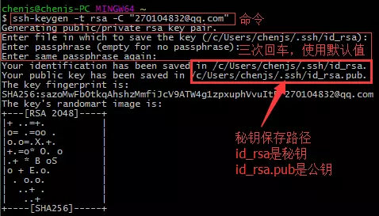

# ssh & Key

## Ubuntu

### Git本地环境配置

##### 1. 安装git

```zsh
sudo apt-get install git
```

##### 2. 配置用户信息

```zsh
$ git config --global user.name "Your Name"
$ git config --global user.email Your_email@example.com
```

##### 3. 初始化本地仓库配置

```zsh
git init
```

### 通过SSH连接Github

##### 1. 安装SSH

```zsh
sudo apt-get install ssh
```

首先 ssh-keygen 会确认密钥的存储位置和文件名（默认是 .ssh/id_rsa）,然后需要输入两次密钥口令，留空即可。所以一般选用默认，全部回车即可。

##### 2. 创建密钥文件

```zsh
ssh-keygen -t rsa -C "你的github账号邮箱"
```

默认密钥文件路径在`~/.ssh`，`id_rsa`是私钥文件，`id_rsa.pub`是公钥文件

##### 3. 将公钥添加到Github

1. 将`id_rsa.pub`文件内容全部复制
2. 登陆到GitHub上，右上角小头像`->Setting->SSH and GPG keys`中，点击`new SSH key`。

##### 4. SSH测试

```zsh
ssh -T git@github.com
```

如果结果为 “ ...You've successfully authenticated, but GitHub does not provide shell access”，则说明成功。

##### 5. 设置远程仓库

```zsh
git remote add origin git@github.com:Username/Repositories_Name.git
```

*如果手误输错，可通过`git remote remove origin`命令删除该远程仓库。*

##### 6.最终测试

1. 在本地创建更改
2. `git add xxx`
3. `git commit -m "xxxxxx"`
4. `git push origin master`


## Windows

#### 设置GitHub的user name和email

```zsh
git config --global user.name "Git账号" git config --global user.email "Git邮箱"
```

#### 生成一个新的SSH密钥

打开 Git Bash，输入如下命令，然后连续按三个回车即可：
 `ssh-keygen -t rsa -C "your_email@example.com"`



生成一个新的密码

注：生成的SSH私钥路径 `C:/Users/yn/.ssh/id_rsa` 后面要用到。

#### 将SSH私钥添加到 ssh-agent

配置 ssh-agent 程序使用 SSH key

1. 在后台启动 ssh-agent
    `eval $(ssh-agent -s)` 
2. 将SSH私钥添加到 ssh-agent
    `ssh-add /c/Users/chenjs/.ssh/id_rsa` 

#### 将SSH公钥添加到GitHub账户

配置GitHub账户使用 SSH key

1. 先复制SSH公钥的完整内容（`C:/Users/yn/.ssh/id_rsa.pub`)

    `clip < /c/Users/yn/.ssh/id_rsa.pub`

2. 进入GitHub的设置页面

3. 点击左部侧边栏的 `SSH keys` 选项

4. 点击 `Add SSH key` 按钮

5. 在Title输入框内，为你的新key取个名字，在Key输入框内，粘贴前面复制好的公钥内容，然后点击 Add key 按钮即可。

#### 测试连接

打开 Git Bash 输入：
 `ssh -T git@github.com`

输入yes后回车


如果提示中的用户名是你的，说明`SSH key`已经配置成功。
如果提示的是“ access denied”， you can [read these instructions for diagnosing the issue](https://link.jianshu.com?t=https://help.github.com/articles/error-permission-denied-publickey).