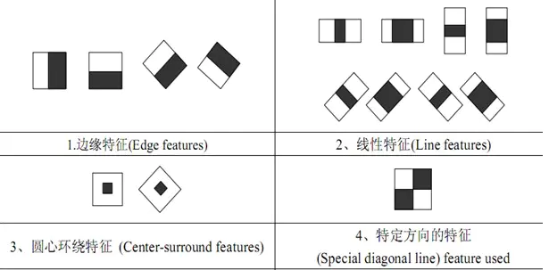

## Text-to-Images

### 数据集建立

#### opencv人脸检测

> haar特征与AdaBoost结合做人脸识别
>
> haar特征：分为三类——边缘特征、线性特征、中心特征和对角线特征，组合成特征模板。特征模板内有白色和黑色两种矩形，并定义该模板的特征值为白色矩形像素和减去黑色矩形像素和。Haar特征值反映了图像的灰度变化情况。色块矩阵姿态包括水平、垂直、斜45度。——计算方法：积分图
>
> 
>
> 图像特征还有HOG和LBP特征最常见。
>
> AdaBoost：

### Triplet loss  

> 深度学习中的一种损失函数，用于训练**差异性较小**的样本。**triplet loss的优势在于细节区分**，即当两个输入相似时，**triplet loss能够更好地对细节进行建模，相当于加入了两个输入差异性差异的度量，学习到输入的更好表示**，从而在上述两个任务中有出色的表现
>
> - 输入：三个输入，锚（anchor）、正例（positive）、负例（negative），不同示例的**结构**相同；
> - 模型：一个共享模型，支持替换为**任意**网络结构；
> - 输出：一个输出，即三个模型输出的拼接。
>
> 公式：$L=max(d(a,p)-d(a,n)+margin, 0)$
>
> 优化目标为：拉进a和p的距离，增大a和n的距离。
>
> - `easy triplets`: $L=0$ 即 $d(a,p)+margin< d(a,n)$，这种情况不需要优化，天然`a, p`的距离很近， `a, n`的距离远.
> - `hard triplets`: $d(a,n)<d(a,p)$, 即`a, p`的距离远
> - `semi-hard triplets`: $d(a,p)<d(a,n)<d(a,p)+margin$,  即`a, n`的距离靠的很近，但是有一个`margin`
>
> soft-margin函数：$s(x)=ln(1+e^x)$

### 注意力机制

### DMGAN